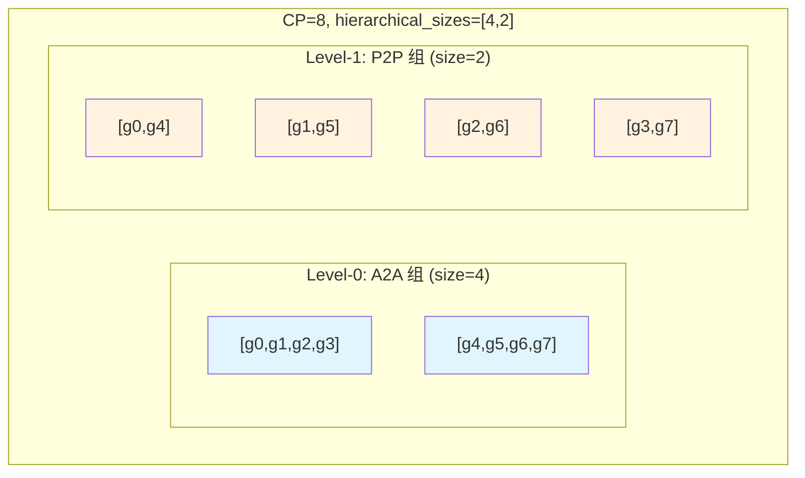
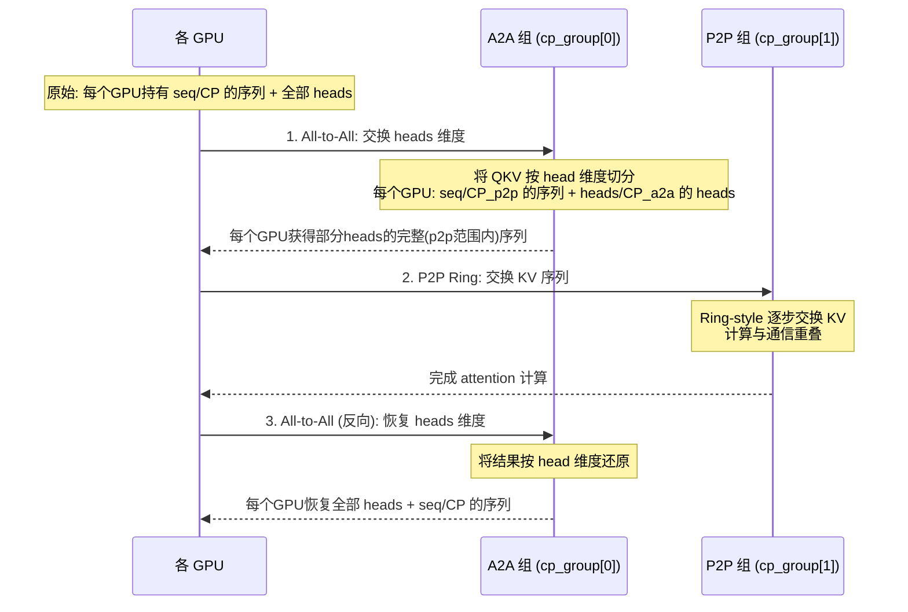

---
title: Hierarchical Context Parallel
layout: default
---
## HCP（Hierarchical Context Parallel）通讯组的分布与组合

### 1. 入口：`initialize_model_parallel` 中的参数

在 `parallel_state.py` 的 `initialize_model_parallel` 函数中，有一个关键参数：

```python
hierarchical_context_parallel_sizes: Optional[List[int]] = None
```

这个参数是一个 **整数列表**，表示 CP 的层级分解方式。约束条件是：

```python
assert np.prod(hierarchical_context_parallel_sizes) == context_parallel_size
```

即列表中所有元素的乘积必须等于 `context_parallel_size`。

### 2. 核心函数：`create_hierarchical_groups`

创建逻辑在 `create_hierarchical_groups` 函数中（第 360 行），它的文档注释给出了一个非常清晰的例子：

> 假设 CP group 有 16 个 GPU（g0 ~ g15），`hierarchical_group_sizes = [2, 2, 4]`，则创建：

| 层级 | 子组数量 | 子组内容 |
|------|---------|---------|
| **Level-1** (size=2) | 8 个 | `[g0,g1]`, `[g2,g3]`, `[g4,g5]`, `[g6,g7]`, `[g8,g9]`, `[g10,g11]`, `[g12,g13]`, `[g14,g15]` |
| **Level-2** (size=2) | 8 个 | `[g0,g2]`, `[g1,g3]`, `[g4,g6]`, `[g5,g7]`, `[g8,g10]`, `[g9,g11]`, `[g12,g14]`, `[g13,g15]` |
| **Level-3** (size=4) | 4 个 | `[g0,g4,g8,g12]`, `[g1,g5,g9,g13]`, `[g2,g6,g10,g14]`, `[g3,g7,g11,g15]` |

### 3. 分组算法：einops rearrange

核心的分组逻辑使用了 `einops.rearrange`：

```python
for level in range(len(hierarchical_group_sizes)):
    rearranged_ranks = einops.rearrange(
        np.array(ranks),
        "(l s u) -> (l u) s",
        u=int(np.prod(hierarchical_group_sizes[:level])),      # 低层级的乘积
        s=hierarchical_group_sizes[level],                      # 当前层级的大小
        l=int(np.prod(hierarchical_group_sizes[level + 1 :])),  # 高层级的乘积
    ).tolist()
```

这个 rearrange 的含义是：
- 将 `ranks` 数组视为三维 `(l, s, u)` 的展平
- `s` = 当前层级的组大小
- `u` = 所有**低于**当前层级的大小的乘积（即已经在更内层分过组的维度）
- `l` = 所有**高于**当前层级的大小的乘积（即外层还没分的维度）
- 重排为 `(l*u, s)`，每一行就是一个子组

让我用 `[2, 2, 4]` 的例子手动推演：

```
ranks = [g0, g1, g2, g3, g4, g5, g6, g7, g8, g9, g10, g11, g12, g13, g14, g15]

=== Level 0 (s=2) ===
u = prod([]) = 1,  s = 2,  l = prod([2,4]) = 8
reshape: (l=8, s=2, u=1) -> (8*1, 2) = (8, 2)
结果: [g0,g1], [g2,g3], [g4,g5], [g6,g7], [g8,g9], [g10,g11], [g12,g13], [g14,g15]
→ 相邻的2个GPU一组

=== Level 1 (s=2) ===
u = prod([2]) = 2,  s = 2,  l = prod([4]) = 4
reshape: (l=4, s=2, u=2) -> (4*2, 2) = (8, 2)
原始: [g0,g1,g2,g3, g4,g5,g6,g7, g8,g9,g10,g11, g12,g13,g14,g15]
视为 (4, 2, 2): [[[g0,g1],[g2,g3]], [[g4,g5],[g6,g7]], [[g8,g9],[g10,g11]], [[g12,g13],[g14,g15]]]
rearrange (l,s,u)->(l*u,s): 
  → [g0,g2], [g1,g3], [g4,g6], [g5,g7], [g8,g10], [g9,g11], [g12,g14], [g13,g15]
→ 跨越Level-0组的"间隔"配对

=== Level 2 (s=4) ===
u = prod([2,2]) = 4,  s = 4,  l = prod([]) = 1
reshape: (l=1, s=4, u=4) -> (1*4, 4) = (4, 4)
视为 (1, 4, 4): [[g0,g1,g2,g3], [g4,g5,g6,g7], [g8,g9,g10,g11], [g12,g13,g14,g15]]
rearrange (l,s,u)->(l*u,s):
  → [g0,g4,g8,g12], [g1,g5,g9,g13], [g2,g6,g10,g14], [g3,g7,g11,g15]
→ 跨越所有低层级组的"最远距离"配对
```

### 4. 每个 rank 持有的 HCP groups

每个 rank 最终持有一个 **list**，长度等于层级数。例如对于 `g0`：

```python
_HIERARCHICAL_CONTEXT_PARALLEL_GROUPS = [
    group_for([g0, g1]),       # Level-0: a2a 组
    group_for([g0, g2]),       # Level-1: p2p 组
    group_for([g0, g4, g8, g12])  # Level-2: p2p 组
]
```

### 5. 在 TE 中的使用：`a2a+p2p` 通信模式

在 `transformer_engine.py` 的 `TEDotProductAttention.__init__` 中：

```python
if cp_comm_type == "a2a+p2p":
    extra_kwargs["cp_comm_type"] = "a2a+p2p"
    extra_kwargs["cp_group"] = get_hierarchical_context_parallel_groups(
        check_initialized=False
    )  # 返回 list of process groups
```

**但实际上 TE 只使用 2 层**。在 `context_parallel.py` 的入口处：

```python
if cp_comm_type == "a2a+p2p":
    assert isinstance(cp_group, list) and len(cp_group) == 2
    # cp_group[0] = a2a_cp_group (Level-0)
    # cp_group[1] = p2p_cp_group (Level-1)
```

所以在实际使用中，`hierarchical_context_parallel_sizes` 通常是 **2 个元素的列表**，例如 `[4, 2]`（表示 CP=8 分为 a2a 组大小 4 + p2p 组大小 2）。

### 6. 两阶段通信流程图



**通信流程**：



具体在 `AttnFuncWithCPAndKVP2P.forward` 中：

```python
# 解包 hierarchical groups
cp_group_a2a = cp_group[0]   # Level-0: A2A 组
cp_group = cp_group[1]        # Level-1: P2P 组

# 第一阶段: A2A 通信 - 交换 attention heads
if cp_size_a2a > 1:
    q, k, v = flash_attn_a2a_communicate(
        [q, k, v], chunk_ids_for_a2a, seq_dim, cp_size_a2a, cp_group_a2a, cp_stream, True
    )

# 第二阶段: P2P Ring 通信 - 交换 KV 序列块（与计算重叠）
# ... ring attention 的 send/recv 循环 ...
```

### 7. A2A 通信的数据变换细节

`flash_attn_a2a_communicate` 在 attention **之前**做的事情：

1. **切分 heads**：`[b, s, np, hn] → [b, s, cp_a2a, np//cp_a2a, hn]`
2. **移动 cp 维度到最前**：`→ [cp_a2a, b, s, np//cp_a2a, hn]`（为 all_to_all 准备）
3. **All-to-All 通信**：每个 GPU 发送自己的 head 切片，接收其他 GPU 的序列切片
4. **序列重排**：将收到的序列块按 causal attention 的 load-balancing 顺序重排
5. **合并序列维度**：`[b, cp_a2a*2, s//2, np//cp_a2a, hn] → [b, cp_a2a*s, np//cp_a2a, hn]`

### 总结

| 概念 | 说明 |
|------|------|
| **HCP 的本质** | 将 CP 组分解为多个层级的子组，支持不同层级使用不同的通信原语 |
| **分组算法** | 使用 `einops.rearrange("(l s u) -> (l u) s")` 实现层级化分组，低层级组内相邻，高层级组间跨越 |
| **TE 实际使用** | 只用 2 层：`cp_group[0]` 为 A2A 组，`cp_group[1]` 为 P2P 组 |
| **A2A 阶段** | 在 A2A 组内交换 attention heads，使每个 GPU 持有更少的 heads 但更多的序列 |
| **P2P 阶段** | 在 P2P 组内用 Ring 拓扑交换 KV，实现计算与通信重叠 |
| **优势** | 结合了 A2A（减少通信轮次）和 P2P（计算通信重叠）的优点，参考论文 [LongVILA](https://arxiv.org/abs/2408.10188) 和 [USP](https://arxiv.org/abs/2405.07719) |
