---
title: Fine-Grained Activation Offload
layout: default
category: megatron
---
[任务规划完成]
# `ChunkOffloadHandler` 类分析

## 类的作用

`ChunkOffloadHandler` 是**流水线并行（Pipeline Parallelism）中单个 chunk（微批次）的激活值卸载/重载处理器**。它负责：

1. **将前向传播中保存的激活张量（activation tensors）从 GPU 异步拷贝到 CPU**（offload），以释放 GPU 显存
2. **在反向传播需要这些激活值时，将它们从 CPU 异步拷贝回 GPU**（reload）
3. **以"组"（group）为粒度**管理 offload/reload，每个 group 对应一个 transformer layer 的激活

## 如何起作用

整体工作流程如下：

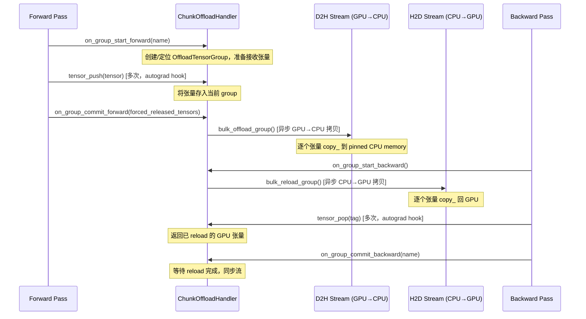

## 成双成对的函数解析

这些函数是**前向/反向对称设计**的，每对函数在前向和反向中分别被调用：

| 前向函数 | 反向函数 | 作用 |
|---------|---------|------|
| `on_group_start_forward(name)` | `on_group_start_backward()` | **组的开始**：前向时递增 group index、创建 group 并准备接收张量；反向时触发从 CPU reload 张量回 GPU |
| `on_group_commit_forward(forced_released_tensors)` | `on_group_commit_backward(name)` | **组的结束**：前向时触发异步 offload 到 CPU 并可选释放 GPU 显存；反向时等待 reload 完成、同步 CUDA 流 |
| `tensor_push(tensor)` | `tensor_pop(tensor_tag)` | **单个张量的存取**：前向时将张量存入 group 并返回 tag；反向时根据 tag 取回张量（如已 offload 则先 reload） |
| `offload(src_tensor)` | `reload(state)` | **底层拷贝操作**：offload 将 GPU 张量拷贝到 CPU pinned memory；reload 将 CPU 张量拷贝回 GPU |
| `bulk_offload_group()` | `bulk_reload_group()` | **批量操作**：对整个 group 内所有需要 offload 的张量执行批量 offload/reload，使用独立 CUDA stream 实现异步 |

### 详细说明

1. **`on_group_start_forward` / `on_group_start_backward`**
   - 前向：标记一个新 layer group 的开始，warmup 阶段会创建 `OffloadTensorGroup`，非 warmup 阶段按 name 定位已有 group
   - 反向：在反向开始时，等待计算流完成，然后触发 `bulk_reload()` 将下一个 group 的数据预取回 GPU

2. **`on_group_commit_forward` / `on_group_commit_backward`**
   - 前向：标记 layer group 结束，让 D2H stream 等待计算流完成后，执行 `bulk_offload()` 将该 group 的激活异步拷贝到 CPU
   - 反向：确保当前 backward chunk 正确，等待 H2D stream 上的 reload event 完成，保证张量已经在 GPU 上可用

3. **`bulk_offload_group` / `bulk_reload_group`**
   - offload：在 D2H stream 上遍历 group 内所有张量，调用 `offload()` 拷贝到 CPU，记录 offload event
   - reload：在 H2D stream 上先等待 offload event（确保数据已到 CPU），再遍历所有 tuple 状态的张量调用 `reload()` 拷回 GPU，记录 reload event

这种对称设计的核心思想是：**利用独立的 CUDA stream 实现计算与数据传输的重叠（overlap）**，前向时计算下一层的同时异步 offload 上一层的激活，反向时计算当前层梯度的同时异步 reload 下一层需要的激活，从而在节省 GPU 显存的同时最小化性能损失。


[任务规划完成]
# `PipelineOffloadManager` 类中索引属性详解

我来帮你理清这些让人头晕的索引属性和 pop/cur 方法的语义。

## 核心索引属性一览

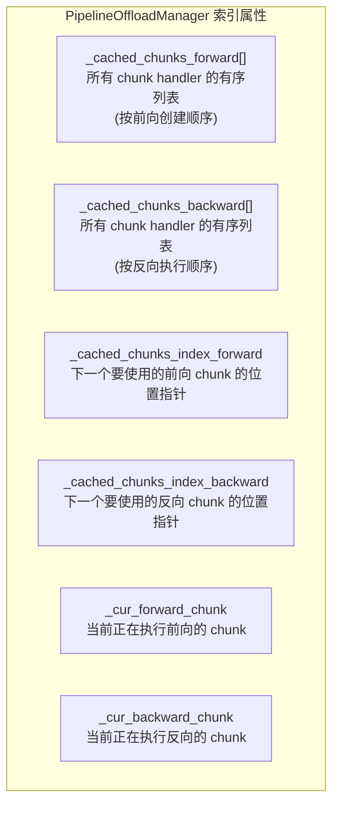

## 属性详细解释

| 属性 | 类型 | 初始值 | 作用 | 何时变化 |
|------|------|--------|------|----------|
| `_cached_chunks_forward` | `list[ChunkOffloadHandler]` | `[]` | warmup 阶段收集的所有 chunk，按**前向创建顺序**排列 | warmup 时每次 `init_model_chunk_offload_handler` 追加 |
| `_cached_chunks_backward` | `list[ChunkOffloadHandler]` | `[]` | warmup 阶段收集的所有 chunk，按**反向执行顺序**排列 | warmup 时每次 `push()` 追加 |
| `_cached_chunks_index_forward` | `int` | `0` | 指向 `_cached_chunks_forward` 中**下一个待消费**的 chunk | `pop_forward_chunk()` 中递增 |
| `_cached_chunks_index_backward` | `int` | `0` | 指向 `_cached_chunks_backward` 中**下一个待消费**的 chunk | `pop_backward_chunk()` 中递增 |
| `_cur_forward_chunk` | `ChunkOffloadHandler` | `None` | 当前正在执行前向传播的那个 chunk handler | `pop_forward_chunk()` / `init_model_chunk_offload_handler()` 设置 |
| `_cur_backward_chunk` | `ChunkOffloadHandler` | `None` | 当前正在执行反向传播的那个 chunk handler | `pop_backward_chunk()` 设置 |

## `pop_forward_chunk(name)` 的行为

```python
def pop_forward_chunk(self, name=None):
    # 如果 offload 关闭，直接返回当前 chunk（不切换）
    if not self.do_offload:
        return self._cur_forward_chunk
    
    # 关键逻辑：当前 chunk 为 None 或者当前 chunk 已经处理完所有名为 name 的 group 时
    # → 切换到下一个 chunk
    while not self._is_warmup and (
        self._cur_forward_chunk is None or self._cur_forward_chunk.finish_all_groups(name)
    ):
        # 从 _cached_chunks_forward 中取下一个
        self._cur_forward_chunk = self._cached_chunks_forward[self._cached_chunks_index_forward]
        self._cached_chunks_index_forward += 1
    
    return self._cur_forward_chunk
```

**语义**：返回的是**当前 layer 所属的 chunk**。它的逻辑是：
- 如果当前 chunk 还有名为 `name` 的 group 没处理完 → 返回当前 chunk（**当前 layer 的**）
- 如果当前 chunk 已经处理完所有该 name 的 group → 自动切换到下一个 chunk（**下一个 microbatch 的**）

## `pop_backward_chunk(name)` 的行为

```python
def pop_backward_chunk(self, name=None):
    self._cur_backward_chunk = None
    # 从 _cached_chunks_index_backward 开始遍历
    for idx, handler in enumerate(
        self._cached_chunks_backward[self._cached_chunks_index_backward:]
    ):
        self._cached_chunks_index_backward += 1
        if not handler.is_empty_chunk(name):
            self._cur_backward_chunk = handler  # 找到第一个包含该 name group 的 chunk
            break
    assert self._cur_backward_chunk is not None
```

**语义**：找到**下一个包含名为 `name` 的 group 的 chunk**，设为当前反向 chunk。这是**当前 layer 的**，因为它在 `on_group_commit_backward` 中被调用来确保正确的 chunk 被激活。

## `cur_forward_chunk()` vs `pop_forward_chunk()`

| 方法 | 是否切换 | 返回什么 |
|------|----------|----------|
| `cur_forward_chunk()` | ❌ 不切换 | 当前 chunk，纯 getter |
| `pop_forward_chunk(name)` | ✅ 可能切换 | 如果当前 chunk 已完成该 name 的所有 group，则切换到下一个 chunk 并返回 |

## `cur_backward_chunk()` vs `pop_backward_chunk()`

| 方法 | 是否切换 | 返回什么 |
|------|----------|----------|
| `cur_backward_chunk()` | ❌ 不切换 | 当前 chunk，纯 getter |
| `pop_backward_chunk(name)` | ✅ 强制切换 | 从队列中找到下一个包含该 name 的 chunk，设为当前 |

## 完整的调用时序图

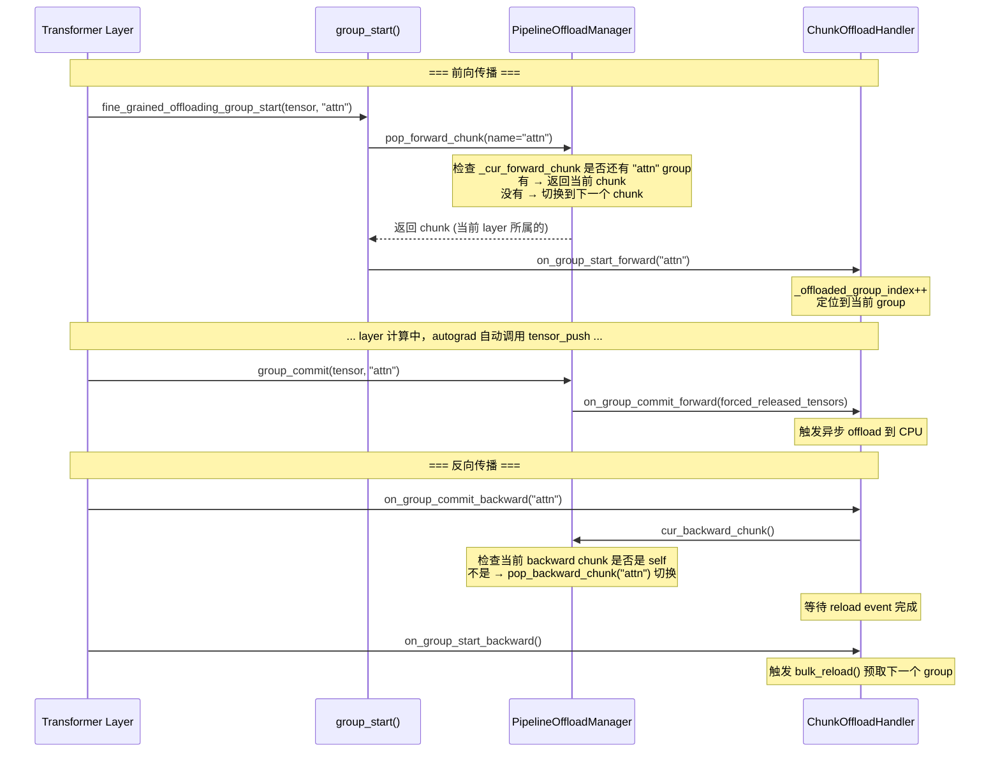

## 关键理解点

1. **`pop` = "消费式获取"**：每次调用都可能推进索引指针，类似迭代器的 `next()`
2. **`cur` = "只读获取"**：纯 getter，不改变任何状态
3. **前向中 `pop_forward_chunk` 返回的是当前 layer 所属的 chunk**，不是 prev layer 的。它只在当前 chunk 的所有同名 group 都处理完时才切换到下一个 chunk
4. **反向中 `pop_backward_chunk` 也是找当前 layer 所属的 chunk**，它跳过不包含目标 group 的 chunk
5. **`_offloaded_group_index`（在 ChunkOffloadHandler 内）** 是 chunk 内部的 group 计数器，每次 `on_group_start_forward` 递增，指向**当前正在处理的 group**

## 一个具体例子

假设有 2 个 microbatch（chunk0, chunk1），每个 chunk 有 2 层（attn, mlp）：

```
_cached_chunks_forward = [chunk0, chunk1]
_cached_chunks_index_forward = 0

# 第一次 pop_forward_chunk("attn"):
#   chunk0 还没处理过 → 返回 chunk0, index 不变
#   _cur_forward_chunk = chunk0

# chunk0 内部: on_group_start_forward("attn") → _offloaded_group_index = 1
# chunk0 内部: on_group_start_forward("mlp")  → _offloaded_group_index = 2

# 第二次 pop_forward_chunk("attn"):
#   chunk0.finish_all_groups("attn") == True (已经没有更多 "attn" group)
#   → 切换: _cur_forward_chunk = chunk1, _cached_chunks_index_forward = 1
```

这样你就能看到：**`pop_forward_chunk` 总是返回"当前 layer 应该属于哪个 chunk"**，而不是 prev layer 的。

[任务规划完成]
# Chunk 的创建：一个 microbatch 创建一个

## 答案

**Chunk（`ChunkOffloadHandler`）是一个 microbatch 创建一个**，而不是一个 layer 创建一个。

## 创建位置

Chunk 在 `PipelineOffloadManager.init_model_chunk_offload_handler()` 方法中创建（第 395-430 行）：

```python
cur_chunk = ChunkOffloadHandler(min_offloaded_tensor_size, self._cpu_tensor_pool)
self._stages[cur_vpp_rank].append(cur_chunk)
self._cur_forward_chunk = cur_chunk
self._cached_chunks_forward.append(cur_chunk)
```

## 谁调用了这个方法

通过 `FineGrainedActivationOffloadingInterface.init_chunk_handler()` 静态方法调用：

```python
@staticmethod
def init_chunk_handler(vp_size, vp_stage, min_offloaded_tensor_size):
    """Initialize the chunk handler, called at the start of a microbatch forward pass."""
    PipelineOffloadManager.get_instance().init_model_chunk_offload_handler(
        vp_size, vp_stage, min_offloaded_tensor_size
    )
```

注意注释已经明确说了：**"called at the start of a microbatch forward pass"**。
[查找文件]
[读取文件]
[查找文件]
[读取文件]
现在完全确认了。让我总结一下：

---

# Chunk 的创建：一个 microbatch 创建一个

## 结论

**`ChunkOffloadHandler`（即 chunk）是每个 microbatch 创建一个**，不是每个 layer 创建一个。

## 创建链路

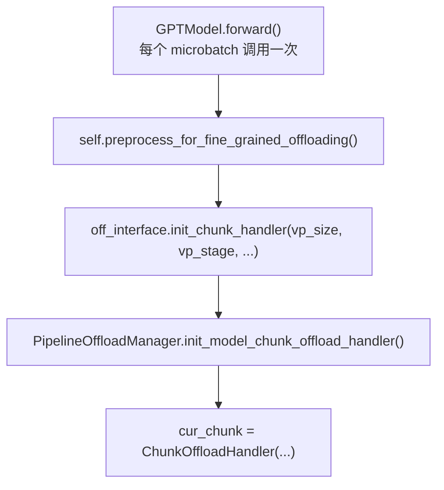

在 `gpt_model.py` 第 501 行：

```python
def forward(self, input_ids, position_ids, attention_mask, ...):
    if self.config.fine_grained_activation_offloading:
        self.preprocess_for_fine_grained_offloading()  # ← 每次 forward 调用一次
```

而 `GPTModel.forward()` 是**每个 microbatch 调用一次**的（在 pipeline parallelism 中，scheduler 会对每个 microbatch 调用一次模型的 forward）。

## Chunk vs Layer 的关系

| 概念 | 粒度 | 数量关系 |
|------|------|----------|
| **Chunk** (`ChunkOffloadHandler`) | 一个 microbatch | 假设有 N 个 microbatch，就有 N 个 chunk |
| **Group** (`OffloadTensorGroup`) | 一个 layer 的一个子模块 | 每个 chunk 内有多个 group（如 attn、mlp 各一个 × layer 数） |

简单来说：
- **1 个 chunk = 1 个 microbatch 经过所有 layer 时产生的全部激活**
- **1 个 group = 1 个 microbatch 经过某一层的某个子模块（如 attn 或 mlp）时产生的激活**

## 举例

假设有 4 个 microbatch，模型有 2 层（每层有 attn + mlp）：

```
chunk0 (microbatch 0):
  ├── group[0]: "attn"  (layer 0 的 attention 激活)
  ├── group[1]: "mlp"   (layer 0 的 MLP 激活)
  ├── group[2]: "attn"  (layer 1 的 attention 激活)
  └── group[3]: "mlp"   (layer 1 的 MLP 激活)

chunk1 (microbatch 1):
  ├── group[0]: "attn"
  ├── group[1]: "mlp"
  ├── group[2]: "attn"
  └── group[3]: "mlp"

chunk2 (microbatch 2): ...
chunk3 (microbatch 3): ...
```

所以 chunk 是 microbatch 级别的容器，group 才是 layer 级别的容器。

[任务规划完成]
[查找文件]
[读取文件]
[读取文件]
现在我已经完全理解了这两个方法的作用和范围。让我来解释：

---

# `PipelineOffloadManager.__enter__` / `__exit__` 的作用和范围

## 核心作用

这对 `__enter__` / `__exit__` 的本质是**注册/注销 PyTorch autograd 的 saved tensor hook**，让 PyTorch 在这个范围内自动拦截所有 `save_for_backward` 的 tensor，将它们交给 offload 系统管理。

```python
def __enter__(self):
    # 1. 启用 TE 的 CPU offload 标志
    cpu_offload.CPUOffloadEnabled = True
    # 2. 注册 autograd hook：拦截所有 save_for_backward 的 tensor
    torch._C._autograd._push_saved_tensors_default_hooks(
        self.on_save_for_backward,   # 前向时：tensor 被 save 时调用
        self.on_get_saved_tensor     # 反向时：tensor 被取回时调用
    )

def __exit__(self, *args):
    # 1. 关闭 TE 的 CPU offload 标志
    cpu_offload.CPUOffloadEnabled = False
    # 2. 注销 autograd hook
    torch._C._autograd._pop_saved_tensors_default_hooks()
```

### 两个 hook 的语义

| Hook | 调用时机 | 作用 |
|------|----------|------|
| `on_save_for_backward(tensor)` | 前向传播中，任何算子调用 `ctx.save_for_backward(tensor)` 时 | 将 tensor 推入当前 chunk 的当前 group（`tensor_push`） |
| `on_get_saved_tensor(tag)` | 反向传播中，任何算子从 `ctx.saved_tensors` 取 tensor 时 | 从 chunk 中取回 tensor（可能需要从 CPU reload） |

## 针对的范围有多大？

**范围是一个 layer 内的一个子模块（如 qkv_linear、attn_proj、attn_norm 等）**，而不是整个 layer 或整个模型。

### 调用链

`PipelineOffloadManager.__enter__/__exit__` 不是直接被用户代码调用的，而是通过 `FineGrainedActivationOffloadingInterface` 间接调用：

```python
# FineGrainedActivationOffloadingInterface.__enter__
def __enter__(self):
    if self.offload:
        self.tensor = fine_grained_offloading_group_start(self.tensor, self.name)  # group_start
        PipelineOffloadManager.get_instance().__enter__()  # ← 注册 hook
    return self.tensor

def __exit__(self, *args):
    if self.offload:
        PipelineOffloadManager.get_instance().__exit__()   # ← 注销 hook
```

### 实际使用示例

在 `attention.py` 中：

```python
with off_interface(self.offload_qkv_linear, hidden_states, "qkv_linear") as hidden_states:
    qkv_output = self.get_query_key_value_tensors(hidden_states, ...)
```

在 `transformer_layer.py` 中：

```python
with off_interface(self.offload_attn_norm, hidden_states, "attn_norm") as hidden_states:
    input_layernorm_output = self.input_layernorm(hidden_states)
```

**每个 `with` 块只包裹一个具体的子计算**（如一次 linear 运算、一次 layernorm 运算），不是整个 layer。

## 范围示意图

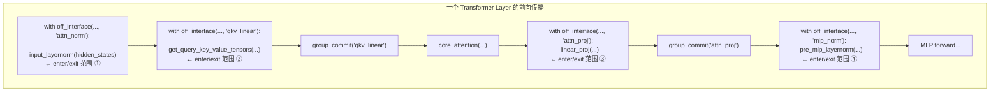

每个 `enter/exit` 范围只覆盖 **一小段计算**（通常是一个 linear 或 norm 操作）。

## 为什么范围这么小？

这是 **"fine-grained"（细粒度）** 的核心含义：

1. **精确控制哪些 tensor 被拦截**：只有在 `with` 块内部执行的算子产生的 `save_for_backward` tensor 才会被 hook 捕获并推入当前 group
2. **不同子模块的 tensor 分到不同 group**：`attn_norm` 的 tensor 归 `attn_norm` group，`qkv_linear` 的 tensor 归 `qkv_linear` group
3. **可以独立控制每个子模块是否 offload**：通过 `self.offload_qkv_linear`、`self.offload_attn_norm` 等 flag 单独开关

## 总结

| 问题 | 答案 |
|------|------|
| `__enter__` 做了什么？ | 注册 autograd hook，让后续所有 `save_for_backward` 的 tensor 被拦截并推入当前 chunk 的当前 group |
| `__exit__` 做了什么？ | 注销 autograd hook，停止拦截 |
| 范围多大？ | **一个 layer 内的一个子模块计算**（如一次 QKV linear、一次 layernorm），非常小 |
| 为什么这么小？ | 细粒度控制：不同子模块的激活分到不同 group，可以独立决定是否 offload |

[任务规划完成]
[读取文件]
现在完全清楚了。关键在第 621 行：

```python
if not self._is_warmup:
    return
```

---

# 为什么 `pop_forward_chunk` 要检测 `_cur_forward_chunk is None`？

## 核心原因：`init_model_chunk_offload_handler` 只在 warmup 阶段创建 chunk

```python
def init_model_chunk_offload_handler(self, vp_size, vp_stage, ...):
    if not self._is_warmup:
        return  # ← 非 warmup 阶段直接返回，不创建任何 chunk！
    ...
    cur_chunk = ChunkOffloadHandler(...)
    self._cur_forward_chunk = cur_chunk
```

**warmup 阶段**（第一个 iteration）：每次 `forward()` 开始时会创建新 chunk 并赋值给 `_cur_forward_chunk`，所以此时它不会是 None。

**非 warmup 阶段**（后续 iteration）：`init_model_chunk_offload_handler` 直接 `return`，**不会创建新 chunk，也不会设置 `_cur_forward_chunk`**。此时 `pop_forward_chunk` 需要自己从 `_cached_chunks_forward` 列表中取出之前 warmup 时缓存好的 chunk。

## `_cur_forward_chunk is None` 代表什么？

有两种情况会导致它为 None：

### 情况 1：非 warmup 阶段的初始状态

在 `reset()` 方法中：

```python
def reset(self):
    self._cur_forward_chunk = None  # ← reset 后为 None
    self._cached_chunks_index_forward = 0
```

每个新 iteration 开始时调用 `reset()`，`_cur_forward_chunk` 被置为 None。此时 `pop_forward_chunk` 的 while 循环会从 `_cached_chunks_forward[0]` 取出第一个缓存的 chunk。

### 情况 2：所有 chunk 都已处理完毕

```python
while not self._is_warmup and (...):
    if self._cached_chunks_index_forward >= len(self._cached_chunks_forward):
        self._cur_forward_chunk = None  # ← 所有 chunk 用完了
        break
```

当 `_cached_chunks_index_forward` 超出 `_cached_chunks_forward` 的长度时，说明所有 microbatch 的 chunk 都已经处理完了，设为 None 表示"没有更多 chunk 可用"。

## 时序对比

```
┌─────────────────────────────────────────────────────────────────────┐
│ Warmup 阶段 (第一个 iteration)                                        │
├─────────────────────────────────────────────────────────────────────┤
│ microbatch 0:                                                       │
│   init_model_chunk_offload_handler() → 创建 chunk0                   │
│     → _cur_forward_chunk = chunk0                                   │
│   pop_forward_chunk("attn_norm") → 直接返回 chunk0 (warmup不走while) │
│                                                                     │
│ microbatch 1:                                                       │
│   init_model_chunk_offload_handler() → 创建 chunk1                   │
│     → _cur_forward_chunk = chunk1                                   │
│   pop_forward_chunk("attn_norm") → 直接返回 chunk1                   │
└─────────────────────────────────────────────────────────────────────┘

┌─────────────────────────────────────────────────────────────────────┐
│ 非 Warmup 阶段 (后续 iteration)                                      │
├─────────────────────────────────────────────────────────────────────┤
│ reset() → _cur_forward_chunk = None, index = 0                      │
│                                                                     │
│ microbatch 0:                                                       │
│   init_model_chunk_offload_handler() → 直接 return (什么都不做)       │
│     → _cur_forward_chunk 仍然是 None!                                │
│   pop_forward_chunk("attn_norm")                                    │
│     → while 检测到 _cur_forward_chunk is None                        │
│     → 从 _cached_chunks_forward[0] 取出 chunk0                      │
│     → _cur_forward_chunk = chunk0                                   │
│                                                                     │
│ microbatch 1:                                                       │
│   init_model_chunk_offload_handler() → 直接 return                   │
│   pop_forward_chunk("attn_norm")                                    │
│     → chunk0.finish_all_groups("attn_norm") == True                 │
│     → 从 _cached_chunks_forward[1] 取出 chunk1                      │
│     → _cur_forward_chunk = chunk1                                   │
└─────────────────────────────────────────────────────────────────────┘
```

## 总结

| 问题 | 答案 |
|------|------|
| 为什么检测 None？ | 因为非 warmup 阶段 `init` 不再创建 chunk，`_cur_forward_chunk` 在 `reset()` 后就是 None |
| None 代表什么？ | ① iteration 刚开始还没取第一个 chunk；② 所有 chunk 都已处理完毕 |
| warmup 时会 None 吗？ | 不会，因为 warmup 时 `init` 每次都会创建并赋值，而且 `pop_forward_chunk` 的 while 条件有 `not self._is_warmup`，warmup 时根本不进入 while 循环 |

所以 `pop_forward_chunk` 中的 None 检测本质上是为**非 warmup 阶段**服务的——此时 chunk 不再被创建，而是从缓存列表中按需取出复用。


[任务规划完成]
[搜索历史上下文]
# 为什么只在 warmup 阶段创建 Chunk？

## 核心原因：**"录制一次，重放多次"的优化模式**

这是一种经典的 **profile-guided optimization（基于 profiling 的优化）** 策略。原因如下：

### 1. Pipeline Schedule 是确定性的

在 pipeline parallelism 中，训练的调度模式（schedule）在每个 iteration 中是**完全相同的**：
- 同样数量的 microbatch
- 同样的前向/反向执行顺序
- 每个 microbatch 经过同样的 layer

这意味着：**第一个 iteration 创建的 chunk 结构（有多少个 chunk、每个 chunk 有多少个 group、每个 group 的 name 是什么）在后续 iteration 中完全不变**。

### 2. Warmup = "录制"阶段

第一个 iteration（warmup）做的事情：

```python
# warmup 阶段：创建 chunk 并收集元信息
def init_model_chunk_offload_handler(self, ...):
    if not self._is_warmup:
        return  # 非 warmup 直接跳过

    cur_chunk = ChunkOffloadHandler(...)
    self._cached_chunks_forward.append(cur_chunk)  # 记录创建顺序
    ...

def on_group_start_forward(self, name):
    if self.is_warmup:
        self.offload_groups.append(OffloadTensorGroup(name))  # 记录 group 结构
        self._max_group_size = max(...)
```

warmup 阶段"录制"了：
- 总共有多少个 chunk（= microbatch 数量）
- 每个 chunk 内有多少个 group（= layer 数 × 子模块数）
- 每个 group 的 name 是什么（"attn"、"mlp" 等）
- 前向顺序和反向顺序分别是什么
- 哪些 group 不需要 offload（`_offload_margin` 优化）

### 3. 后续 iteration = "重放"阶段

后续 iteration 不再创建新 chunk，而是**复用 warmup 时创建的 chunk 对象**：

```python
def reset(self):
    self._cur_forward_chunk = None
    self._cached_chunks_index_forward = 0  # 重置指针到开头
    for chunk in self._cached_chunks_forward:
        chunk.reset()  # 重置 chunk 内部状态，但不销毁

def pop_forward_chunk(self, name=None):
    # 非 warmup 时从缓存列表中按序取出
    while not self._is_warmup and (...):
        self._cur_forward_chunk = self._cached_chunks_forward[self._cached_chunks_index_forward]
        self._cached_chunks_index_forward += 1
```

每个 iteration 开始时 `reset()` 把指针归零，然后按同样的顺序重新遍历这些 chunk。

### 4. 为什么不每次都重新创建？

| 原因 | 说明 |
|------|------|
| **避免重复分配** | `OffloadTensorGroup` 对象、CUDA Event 等不需要每次重新创建 |
| **CPU tensor pool 复用** | warmup 后 pool 中已经有了正确大小的 CPU tensor，后续直接复用，零分配开销 |
| **offload 策略优化** | `post_warmup_callback()` 在 warmup 结束后分析哪些 group 不需要 offload（最后几个 group 跳过 offload 以避免阻塞），这个决策只需做一次 |
| **确定性保证** | 复用同一组 chunk 对象保证了前向/反向的 chunk 匹配关系不会出错 |
| **性能** | 减少 Python 对象创建和 GC 压力 |

### 5. 完整生命周期图

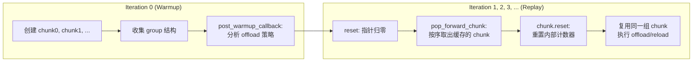

## 类比

可以把它类比为 **CUDA Graph**：
- CUDA Graph 也是"录制一次 kernel 序列，后续直接 replay"
- 这里是"录制一次 chunk/group 结构，后续直接按结构 replay offload/reload"

两者的共同前提都是：**执行模式在每个 iteration 中是确定性重复的**。

[任务规划完成]
# 为什么 `finish_all_groups(name)` 为 True 时要切换 chunk？

## 先看 `pop_forward_chunk` 的核心逻辑

```python
while not self._is_warmup and (
    self._cur_forward_chunk is None or self._cur_forward_chunk.finish_all_groups(name)
):
    # 切换到下一个 chunk
    self._cur_forward_chunk = self._cached_chunks_forward[self._cached_chunks_index_forward]
    self._cached_chunks_index_forward += 1
```

## `finish_all_groups(name)` 的含义

```python
def finish_all_groups(self, name=None) -> bool:
    if (
        len(self._groups_to_reload) == 0
        and len(self._groups_to_offload) == 0
        and self._offloaded_group_index > 0
    ):
        return True
    assert name is not None, "Name is required"
    return self.find_group_with_name(name, self._offloaded_group_index) is None
```

关键是最后一行：**从当前 `_offloaded_group_index` 位置开始，往后找不到任何名为 `name` 的 group 了**。

## 为什么需要这个检查？

### 核心原因：**一个 chunk 对应一个 microbatch，当这个 microbatch 的所有同名 group 都处理完了，说明该 microbatch 的前向已经结束，下一个同名 group 属于下一个 microbatch**

举个具体例子：

```
chunk0 (microbatch 0): [attn_norm, qkv, attn, mlp_norm, mlp]  ← 5个group，对应1层
chunk1 (microbatch 1): [attn_norm, qkv, attn, mlp_norm, mlp]  ← 5个group，对应1层
```

假设有 2 层的情况：

```
chunk0 (microbatch 0): [attn_norm₁, qkv₁, attn₁, mlp_norm₁, mlp₁, attn_norm₂, qkv₂, attn₂, mlp_norm₂, mlp₂]
chunk1 (microbatch 1): [attn_norm₁, qkv₁, attn₁, mlp_norm₁, mlp₁, attn_norm₂, qkv₂, attn₂, mlp_norm₂, mlp₂]
```

当 `pop_forward_chunk(name="attn_norm")` 被调用时：

| 时刻 | `_offloaded_group_index` | `find_group_with_name("attn_norm", index)` | `finish_all_groups` | 行为 |
|------|---|---|---|---|
| Layer 1 开始 | 0 | 找到 `attn_norm₁` | False | 返回 chunk0 |
| Layer 2 开始 | 5 | 找到 `attn_norm₂` | False | 返回 chunk0 |
| microbatch 1 的 Layer 1 开始 | 10 | 找不到了！ | **True** | **切换到 chunk1** |

### 本质逻辑

```
finish_all_groups("attn_norm") == True
```

意味着：**"当前 chunk 中，从当前位置往后，再也没有名为 `attn_norm` 的 group 了"**

这等价于说：**"当前 microbatch 的所有层都已经处理完了这个子模块，接下来遇到的同名 group 一定属于下一个 microbatch"**

所以必须切换到下一个 chunk（= 下一个 microbatch 的容器）。

## 为什么不用简单的计数器？

因为不同 chunk 可能有**不同数量的同名 group**（比如 virtual pipeline parallelism 中，不同 vp stage 可能有不同层数）。用 `find_group_with_name` 做精确查找比硬编码计数更通用、更健壮。

## 总结

| 条件 | 含义 | 动作 |
|------|------|------|
| `finish_all_groups(name) == False` | 当前 chunk 还有该 name 的 group 待处理 | 继续用当前 chunk |
| `finish_all_groups(name) == True` | 当前 chunk 的该 name group 全部处理完了 | 切换到下一个 chunk（下一个 microbatch） |

这是 **chunk（microbatch）边界检测** 的核心机制——通过检查"当前 chunk 是否还有同名 group"来判断是否需要切换到下一个 microbatch 的 chunk。


[任务规划完成]
好问题！让我先看一下 `FineGrainedOffloadingGroupStartFunction` 的具体实现，确认它在计算图中的角色。
[查找文件]
[读取文件]
现在让我再看一下 `on_group_start_backward` 的实现来确认它做了什么：
[读取文件]
现在我完全理解了。让我来回答你的问题。

## 你说得对！`FineGrainedOffloadingGroupStartFunction` 的 backward 是 **post backward hook**，它做的工作是为**前一个 group（prev group）** 服务的

### 先理清计算图中的位置关系

Forward 时，两个 Function 是这样插入的：

```
GroupStart(layer_N)  →  [layer_N 的计算]  →  GroupCommit(layer_N)  →  GroupStart(layer_N+1)  →  [layer_N+1 的计算]  →  GroupCommit(layer_N+1)
```

Backward 时，autograd 反向遍历计算图，**顺序完全反过来**：

```
GroupCommit(layer_N+1).backward  →  [layer_N+1 的反向计算]  →  GroupStart(layer_N+1).backward  →  GroupCommit(layer_N).backward  →  [layer_N 的反向计算]  →  GroupStart(layer_N).backward
```

### 所以每个节点在 backward 中的角色是：

| 节点 | Forward 角色 | Backward 角色 |
|------|-------------|---------------|
| `GroupCommit(layer_N).backward` | layer_N 的 **post forward** | layer_N 的 **pre backward** |
| `GroupStart(layer_N).backward` | layer_N 的 **pre forward** | layer_N 的 **post backward** |

### `GroupStart(layer_N).backward` 做了什么？

```python
def backward(ctx, grad_output):
    cpu_offload_handler = ctx.cpu_offload_handler
    cpu_offload_handler.on_group_start_backward()  # ← 调用 bulk_reload()
    return grad_output, None, None, None
```

它调用了 `on_group_start_backward()` → `bulk_reload()`，即**发起下一批 tensor 的异步 reload**。

因为它是 layer_N 的 **post backward**，此时 layer_N 的反向计算已经完成了。那么接下来要执行的是 **layer_N-1 的反向计算**（`GroupCommit(layer_N-1).backward` → layer_N-1 的计算 → ...）。

所以 **`GroupStart(layer_N).backward` 中的 `bulk_reload()` 是在为 layer_N-1（即前一层）提前 prefetch 激活值**！

### 完整的 backward 时序（以 layer_N 为例）

```
GroupCommit(layer_N).backward        ← pre backward: wait_reload_event，确保 layer_N 的 tensor 已 reload 完成
        ↓
[layer_N 的反向计算]                  ← 使用已 reload 好的 tensor
        ↓
GroupStart(layer_N).backward         ← post backward: bulk_reload()，异步发起 layer_N-1 的 reload
        ↓
GroupCommit(layer_N-1).backward      ← pre backward: wait_reload_event，等 layer_N-1 的 reload 完成
        ↓
[layer_N-1 的反向计算]               ← 使用已 reload 好的 tensor
```

### 为什么这样设计？

这是一个经典的 **double buffering / pipeline prefetch** 策略：

- 在 **当前层反向计算结束后**（post backward），立刻在 h2d_stream 上异步发起**下一层**的 reload
- 这样 reload 操作和后续的计算可以**重叠（overlap）**，隐藏 H2D 传输延迟
- 到下一层真正需要用 tensor 时（`GroupCommit.backward` 中的 `wait_reload_event`），reload 可能已经完成了

所以你的理解完全正确：**`FineGrainedOffloadingGroupStartFunction.backward` 是 post backward hook，它做的 `bulk_reload` 不是为当前 group 服务的，而是为即将到来的前一个 group（prev layer）提前 prefetch 激活值**。


[任务规划完成]
好问题，让我回顾一下之前的对话，看看哪些地方的解读因为没搞清楚 `GroupStart.backward` 是 post backward 而产生了错误。
[搜索历史上下文]
现在我找到了之前的错误。让我再确认一下具体的时序图部分：
[读取历史上下文]
现在我已经找到了之前的错误。让我总结一下：

## 是的，之前确实有几处理解错误

### 错误 1：最早的 `ChunkOffloadHandler` 分析中的时序图

在最早的回答中，我画的时序图是这样的：

```
BWD->>Handler: on_group_start_backward()     ← 放在了 backward 最前面
Handler->>H2D: bulk_reload_group()
BWD->>Handler: tensor_pop(tag)
BWD->>Handler: on_group_commit_backward(name) ← 放在了 backward 最后面
```

这个顺序是**错的**。因为 `on_group_start_backward` 是 `GroupStartFunction.backward`（**post backward**），而 `on_group_commit_backward` 是 `GroupCommitFunction.backward`（**pre backward**）。

**正确的 backward 顺序应该是**：

```
GroupCommit(layer_N).backward  →  on_group_commit_backward()  ← pre backward: 等待 reload 完成
        ↓
[layer_N 的反向计算，tensor_pop() 在这里被调用]
        ↓
GroupStart(layer_N).backward   →  on_group_start_backward()   ← post backward: 发起下一层的 reload
```

### 错误 2：对 `on_group_start_backward` 的描述

我之前说：

> `on_group_start_backward()`：在 backward **一开始**就触发 `bulk_reload()`，在 h2d_stream 上异步地把**整个 group** 的所有 tensor 从 CPU 拷回 GPU

这是错的。`on_group_start_backward` 不是在 backward "一开始"，而是在 **当前层 backward 结束之后**（post backward）。它做的 `bulk_reload()` 是为**下一层（prev layer）** 提前 prefetch，不是为当前层。

### 错误 3：对 `on_group_commit_backward` 的描述

我之前说：

> `on_group_commit_backward()`：在 backward **结束时**调用 `wait_reload_event`，确保 reload 已完成

这也是反的。`on_group_commit_backward` 是 `GroupCommitFunction.backward`，它是 **pre backward**（在当前层反向计算**之前**）。它在这里 `wait_reload_event` 是确保**当前层**的 tensor 已经 reload 完成，可以安全使用。

### 错误 4：prefetch 回答中的时序

在回答"用到的时候才 reload？不用提前 prefetch 吗"时，我画的流程：

```
on_group_start_backward()    ← 在 backward 的一个 group 开始时
    ↓
bulk_reload()                ← 异步发起整个 group 的 H2D 拷贝
    ↓
on_group_commit_backward()   ← 在 backward 的一个 group 结束时
    ↓
wait_reload_event            ← 等待 reload 完成
```

这个顺序也是反的。正确的应该是：

```
on_group_commit_backward()   ← pre backward: 等待当前层的 reload 完成
    ↓
[当前层反向计算，tensor_pop()]
    ↓
on_group_start_backward()    ← post backward: 异步发起下一层的 reload (prefetch)
```

### 总结：核心错误根源

**我之前一直把 `on_group_start_backward` 当成 "pre backward"，把 `on_group_commit_backward` 当成 "post backward"**，因为名字上 "start" 和 "commit" 容易让人联想到 "开始" 和 "结束"。但实际上在 autograd 反向图中，forward 时的顺序是 `Start → Commit`，backward 时完全反过来变成 `Commit.backward → Start.backward`，所以：

| 函数 | Forward 时 | Backward 时 |
|------|-----------|-------------|
| `GroupStart` | **pre forward**（层计算之前） | **post backward**（层反向之后） |
| `GroupCommit` | **post forward**（层计算之后） | **pre backward**（层反向之前） |

正确的理解是：
- **`GroupCommit.backward`（pre backward）**：等待 reload 完成 → 确保当前层的 tensor 可用
- **`GroupStart.backward`（post backward）**：发起 bulk_reload → 为下一层提前 prefetch


[任务规划完成]
好问题！让我先看看 `tensor_pop` 是怎么注册到 autograd hook 的，以及 tensor 在 group 中的状态变化。
[查找文件]
[查找文件]
[查找文件]
[读取文件]
现在我完全理解了整个数据流。让我来回答。

## `tensor_pop` 中的 tuple 检查到底是怎么回事

### 先理清 `tensor_pop` 是怎么被调用的

`tensor_pop` 是通过 PyTorch 的 **saved tensor hook** 机制被调用的。在 `__enter__` 中注册了：

```python
torch._C._autograd._push_saved_tensors_default_hooks(
    self.on_save_for_backward,   # forward 时：tensor → tensor_tag
    self.on_get_saved_tensor     # backward 时：tensor_tag → tensor
)
```

- **Forward 时**：任何 `ctx.save_for_backward(tensor)` 都会被拦截，走 `on_save_for_backward` → `tensor_push`，把原始 tensor 存入 group，返回一个 `tensor_tag`（元组 `(group_id, idx)`）
- **Backward 时**：任何 `ctx.saved_tensors` 的访问都会被拦截，走 `on_get_saved_tensor` → `tensor_pop`，根据 tag 取回 tensor

**关键点**：`tensor_pop` 不是在 `GroupStart/GroupCommit` 的 backward 中调用的，而是在**每个具体计算 op（如 matmul、layernorm 等）的 backward** 中，当它访问 `ctx.saved_tensors` 时被触发。

### tensor 在 group 中有两种状态

一个 tensor 在 `OffloadTensorGroup._tensors` 字典中的值，经历了这样的状态变化：

```
① tensor_push 时：  _tensors[tag] = tensor          （原始 GPU Tensor）
                           ↓
② bulk_offload_group 时：
   如果 tensor_need_offloading_checker 返回 True：
       _tensors[tag] = (device, cpu_backup, use_cpu_pool)   （tuple 状态）
   如果返回 False：
       _tensors[tag] = tensor                                （仍然是原始 Tensor，没动）
                           ↓
③ bulk_reload_group 时（prefetch）：
   如果是 tuple：
       recovered_tensor = self.reload(state)
       _tensors[tag] = recovered_tensor                      （又变回 GPU Tensor）
   如果不是 tuple：
       不处理（本来就是 Tensor）
                           ↓
④ tensor_pop 时：
   pop 出来，检查是不是 tuple
```

### 什么情况下 `tensor_pop` 拿到的**不是 tuple**（正常路径）

**两种情况**：

1. **tensor 太小，根本没被 offload**：`tensor_need_offloading_checker` 返回 False（`tensor.numel() < min_offloaded_tensor_size`），在 `bulk_offload_group` 时就没动它，它一直是原始 GPU Tensor。这种 tensor 也不需要 reload，直接用就行。

2. **tensor 被 offload 了，但已经被 `bulk_reload_group` prefetch 回来了**：在 `bulk_reload_group` 中，tuple 被 `reload` 后又 `push_tensor` 回去变成了 GPU Tensor。所以 `tensor_pop` 拿到的已经是 Tensor 了。

### 什么情况下 `tensor_pop` 拿到的**是 tuple**（fallback 路径）

这发生在 **tensor 被 offload 了（变成了 tuple），但 `bulk_reload_group` 没有处理它** 的情况。具体场景：

1. **`should_bulk_offload` 返回 False**：在 `bulk_offload` 中，如果 `should_bulk_offload()` 返回 False，这个 group 不会被加入 `_groups_to_reload` 队列。但注意！这时候 group 里的 tensor **也不会被 offload**（因为 `bulk_offload_group` 根本没被调用），所以实际上 tensor 还是 Tensor 状态，不会走到 tuple 分支。

2. **真正可能走到 tuple fallback 的场景**：当 `should_bulk_offload` 返回 True，tensor 被 offload 成了 tuple，但由于某种时序原因 `bulk_reload_group` 还没来得及处理这个 group。比如**最后一个 pipeline stage 的最后一层**，`should_bulk_offload` 中有这段逻辑：

   ```python
   # Don't offload the last group with the same name if it's about to be used immediately
   if self.find_next_group(group._name) is None:
       return False
   ```

   但如果这个判断没拦住，tensor 被 offload 了却没被 prefetch 回来，`tensor_pop` 里的 `isinstance(tensor, tuple)` 就是最后的安全网。

### 总结

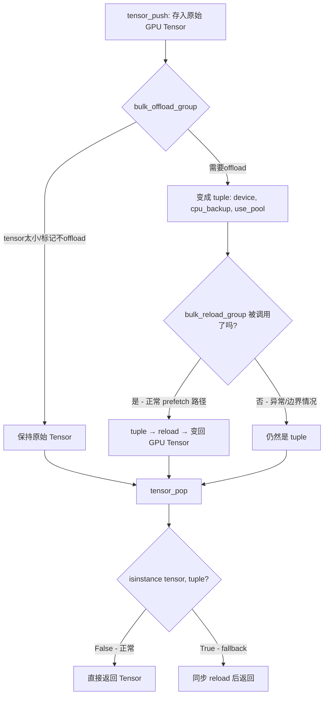

**简单来说**：正常情况下，`tensor_pop` 拿到的要么是**从没被 offload 的小 tensor**（一直是 Tensor），要么是**已经被 prefetch 回来的 tensor**（tuple → Tensor）。`isinstance(tensor, tuple)` 的检查是一个**防御性的 fallback**，处理 prefetch 没覆盖到的边界情况，确保无论如何都能返回可用的 GPU tensor。

这才是真正的 **prefetch pipeline** 设计：在当前层反向结束后，异步发起下一层的 reload，让传输和计算重叠。


[任务规划完成]
好问题！backward 的第一次 reload 确实没法提前 prefetch，让我来找到具体的处理逻辑。
[查找文件]
[读取文件]
[查找文件]
[读取文件]
现在让我再看看 `on_group_commit_backward` 中对第一层的处理——它在 `_reloading_group` 为空时会怎样，以及 `pre_reload_last_layer` 是在什么时候被调用的。
[查找文件]
[读取文件]
现在我完全理解了。让我来回答你的问题。

## BWD 第一次 reload 发生在哪？

你说得对，**backward 的第一个 group（即最后一层 layer）的 reload 确实没法通过正常的 `on_group_start_backward` → `bulk_reload` 来 prefetch**。

原因很简单：正常的 prefetch 链条是这样的：

```
当前层 backward 结束 → GroupStart.backward → on_group_start_backward → bulk_reload（为下一层 prefetch）
```

但最后一层（backward 的第一个 group）之前，**没有任何层的 backward 执行过**，所以没有人触发过 `on_group_start_backward` 来给它 prefetch。

### 解决方案：`pre_reload_last_layer`

代码通过 `pre_reload_last_layer` 来解决这个冷启动问题。它的调用发生在 `bulk_reload()` 中：

```python
def bulk_reload(self):
    if len(self._groups_to_reload) > 0:
        self.bulk_reload_group()       # 正常 prefetch 下一层
    else:
        # 当前 chunk 自己的 groups 都 reload 完了，
        # 去看下一个 backward chunk，提前 reload 它的最后一层
        next_backward_chunk = PipelineOffloadManager.get_instance().front_backward_chunk()
        if (next_backward_chunk is not None
            and next_backward_chunk._offloaded_group_index == next_backward_chunk._max_group_size):
            next_backward_chunk.pre_reload_last_layer()
```

也就是说，当**前一个 chunk（microbatch）的 backward 已经把自己所有 group 都 reload 完了**，它会"顺手"帮**下一个 chunk 的最后一层**提前 reload。

### 那真正的"第一个 chunk 的第一次 reload"呢？

对于整个 backward 过程中**最先开始 backward 的那个 chunk**，它的最后一层确实没有被任何人 prefetch 过。这时候就走到了我们之前讨论的 **`tensor_pop` 中的 tuple fallback**：

```python
def tensor_pop(self, tensor_tag):
    tensor = self.offload_groups[group_id - 1].pop_tensor(tensor_tag)
    if isinstance(tensor, tuple):   # ← 没被 prefetch，还是 tuple 状态
        tensor = self.reload(tensor)  # ← 同步 reload，阻塞等待
    return tensor
```

**但是！** 还有一个特殊路径。看 `on_group_commit_backward`：

```python
def on_group_commit_backward(self, name):
    # ...
    if not is_graph_capturing() and len(self._reloading_group) > 0:
        for reloading_group in self._reloading_group:
            if reloading_group._name == name:
                reloading_group.wait_reload_event(torch.cuda.current_stream())
```

`on_group_commit_backward` 是 `GroupCommit.backward`，即 **pre backward**（反向计算之前）。它会检查 `_reloading_group` 里有没有当前 name 的 group，如果有就 wait。但对于第一个 chunk 的最后一层，`_reloading_group` 是空的，所以这里什么都不做——直接开始 backward 计算，然后在 `tensor_pop` 里逐个同步 reload。

### 完整时序图

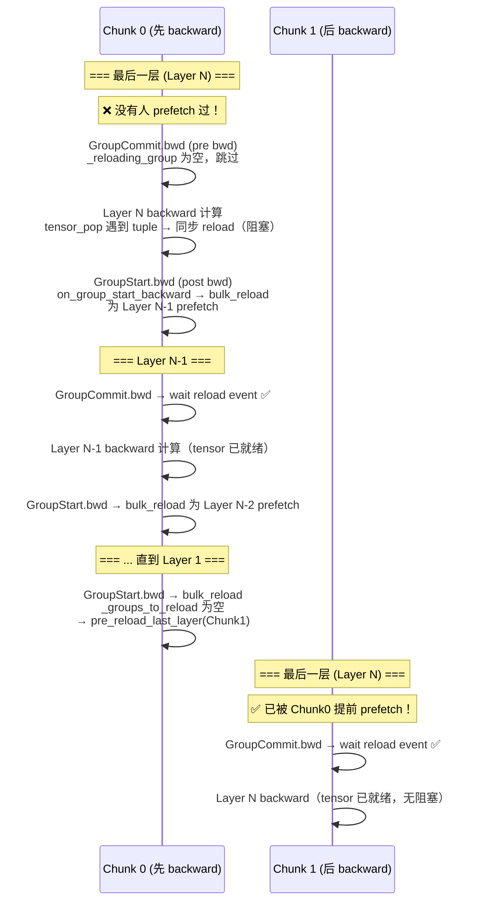

### 总结

| 场景 | 第一次 reload 怎么发生 | 是否有延迟 |
|------|----------------------|-----------|
| **第一个 chunk 的最后一层** | `tensor_pop` 中 tuple fallback，**同步阻塞 reload** | ⚠️ 有延迟，无法隐藏 |
| **后续 chunk 的最后一层** | 被前一个 chunk 的 `pre_reload_last_layer` 提前 prefetch | ✅ 延迟被隐藏 |
| **同一 chunk 内的非最后一层** | 被上一层的 `on_group_start_backward` → `bulk_reload` prefetch | ✅ 延迟被隐藏 |

所以你的直觉完全正确：**第一个 chunk 的最后一层的 reload 确实没法 prefetch，只能同步阻塞等待**。这是一个不可避免的冷启动开销，代码通过 `tensor_pop` 里的 tuple 检查来兜底处理。


[任务规划完成]
让我先全面查看相关代码，理解 forward chunk 和 backward chunk 的完整流转流程。
[查找文件]
[读取文件]
[读取文件]
[读取文件]
现在我已经掌握了所有关键代码。让我来完整梳理 forward chunk 和 backward chunk 的流转和定位流程。

---

# Forward Chunk 和 Backward Chunk 的流转与定位

## 一、两个列表的构建（Warmup 阶段）

Warmup 阶段（第一个 iteration），两个列表同时被构建：

### `_cached_chunks_forward`：按前向创建顺序

在 `init_model_chunk_offload_handler()` 中，每个 microbatch 的 forward 开始时创建一个 chunk 并追加：

```python
cur_chunk = ChunkOffloadHandler(...)
self._cached_chunks_forward.append(cur_chunk)
```

### `_cached_chunks_backward`：按反向执行顺序

在 `push()` 中追加，而 `push()` 是通过 `flush()` 调用的。`flush()` 的关键逻辑是 **`reversed`**：

```python
def flush(self):
    for chunks in reversed(self._stages):
        for chunk in chunks:
            self.push(chunk)
```

### 构建过程图解（以 vp_size=1, 4 个 microbatch 为例）

```
Forward 执行顺序: mb0 → mb1 → mb2 → mb3

_cached_chunks_forward 构建过程:
  init(mb0) → [chunk0]
  init(mb1) → [chunk0, chunk1]
  init(mb2) → [chunk0, chunk1, chunk2]
  init(mb3) → [chunk0, chunk1, chunk2, chunk3]

_cached_chunks_backward 构建过程 (通过 flush + reversed):
  flush 时 push → 反向顺序追加
  最终: [chunk3, chunk2, chunk1, chunk0]
         ↑ 最后 forward 的先 backward
```

> **核心区别**：forward 列表是 **正序**（先创建的在前），backward 列表是 **逆序**（最后 forward 的最先 backward，符合 LIFO 语义）。

## 二、Forward Chunk 的定位流程

### Warmup 阶段

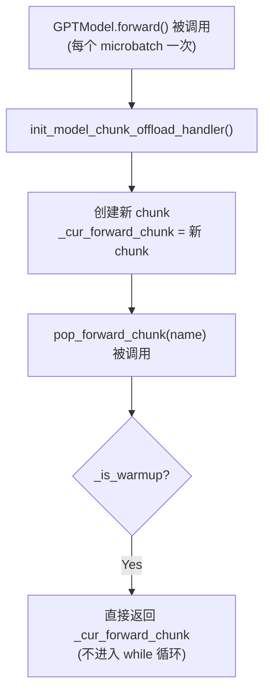

Warmup 时非常简单：`init` 创建并设置了 `_cur_forward_chunk`，`pop_forward_chunk` 直接返回它。

### 非 Warmup 阶段

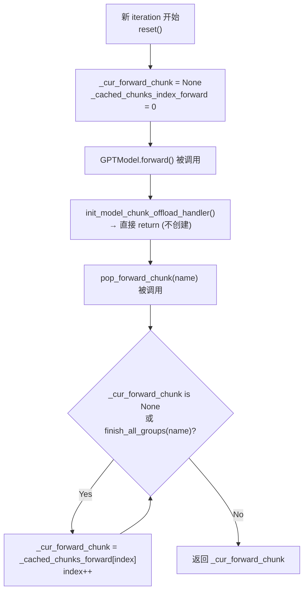

**定位逻辑**：

```python
while not self._is_warmup and (
    self._cur_forward_chunk is None or self._cur_forward_chunk.finish_all_groups(name)
):
    self._cur_forward_chunk = self._cached_chunks_forward[self._cached_chunks_index_forward]
    self._cached_chunks_index_forward += 1
```

- **第一次调用**：`_cur_forward_chunk` 是 None → 从 `_cached_chunks_forward[0]` 取出 chunk0
- **后续调用**：检查当前 chunk 是否还有名为 `name` 的 group 没处理
  - 还有 → 返回当前 chunk（同一个 microbatch 的不同 layer 共用一个 chunk）
  - 没有了 → `finish_all_groups(name)` 返回 True → 切换到下一个 chunk

### `finish_all_groups(name)` 的判断

```python
def finish_all_groups(self, name=None) -> bool:
    # 所有 group 都处理完了
    if len(self._groups_to_reload) == 0 and len(self._groups_to_offload) == 0 
       and self._offloaded_group_index > 0:
        return True
    # 从当前 index 开始找不到同名 group 了
    return self.find_group_with_name(name, self._offloaded_group_index) is None
```

它的意思是：**从 `_offloaded_group_index`（当前已处理到的 group 位置）往后找，如果找不到名为 `name` 的 group 了，说明这个 chunk 里该 name 的 group 全部处理完了**。

## 三、Backward Chunk 的定位流程

### `pop_backward_chunk(name)` —— 消费式定位

```python
def pop_backward_chunk(self, name=None):
    self._cur_backward_chunk = None
    for idx, handler in enumerate(
        self._cached_chunks_backward[self._cached_chunks_index_backward:]
    ):
        self._cached_chunks_index_backward += 1  # 推进指针
        if not handler.is_empty_chunk(name):
            self._cur_backward_chunk = handler
            break
```

**定位逻辑**：从 `_cached_chunks_index_backward` 开始，找到第一个包含名为 `name` 的 group 的 chunk，设为当前 backward chunk，**同时推进指针**。

### `front_backward_chunk(name)` —— 只看不消费

```python
def front_backward_chunk(self, name=None):
    for idx, handler in enumerate(
        self._cached_chunks_backward[self._cached_chunks_index_backward:]
    ):
        if not handler.is_empty_chunk(name):
            return handler
    return None
```

**定位逻辑**：和 `pop` 一样从 `_cached_chunks_index_backward` 开始找，但**不推进指针**。用于 prefetch 时 peek 下一个要处理的 chunk。

### 调用时机

| 方法 | 调用位置 | 作用 |
|------|----------|------|
| `pop_backward_chunk(name)` | `on_group_commit_backward` (pre backward) | 确认当前 backward chunk 是自己，不是则切换 |
| `front_backward_chunk(name)` | `on_group_start_backward` (post backward) | peek 下一个 chunk，用于 prefetch reload |

## 四、完整时序：一个 4-microbatch 的例子

```
假设: vp_size=1, 4 microbatch, 每个 microbatch 过 2 层 (attn + mlp)

=== Warmup (第一个 iteration) ===

Forward:
  mb0: init → chunk0, forward layer0(attn,mlp), layer1(attn,mlp)
  mb1: init → chunk1, forward layer0(attn,mlp), layer1(attn,mlp)
  mb2: init → chunk2, forward layer0(attn,mlp), layer1(attn,mlp)
  mb3: init → chunk3, forward layer0(attn,mlp), layer1(attn,mlp)

构建结果:
  _cached_chunks_forward  = [chunk0, chunk1, chunk2, chunk3]
  _cached_chunks_backward = [chunk3, chunk2, chunk1, chunk0]

Backward (LIFO):
  mb3: pop_backward → chunk3, backward layer1(mlp,attn), layer0(mlp,attn)
  mb2: pop_backward → chunk2, backward layer1(mlp,attn), layer0(mlp,attn)
  mb1: pop_backward → chunk1, backward layer1(mlp,attn), layer0(mlp,attn)
  mb0: pop_backward → chunk0, backward layer1(mlp,attn), layer0(mlp,attn)

=== 非 Warmup (后续 iteration) ===

reset():
  _cur_forward_chunk = None
  _cur_backward_chunk = None
  _cached_chunks_index_forward = 0
  _cached_chunks_index_backward = 0
  每个 chunk.reset() → _offloaded_group_index = 0

Forward:
  mb0: init → return (不创建)
       pop_forward_chunk("attn") → None → 取 _cached_chunks_forward[0] = chunk0
       ... layer0, layer1 ...
       pop_forward_chunk("attn") → chunk0.finish_all_groups("attn")=True
                                  → 取 _cached_chunks_forward[1] = chunk1
  mb1: ... 同理 ...

Backward:
  mb3: pop_backward_chunk("mlp") → _cached_chunks_backward[0] = chunk3
       ... layer1, layer0 ...
  mb2: pop_backward_chunk("mlp") → _cached_chunks_backward[1] = chunk2
       ... 同理 ...
```

## 五、Forward vs Backward 定位机制对比

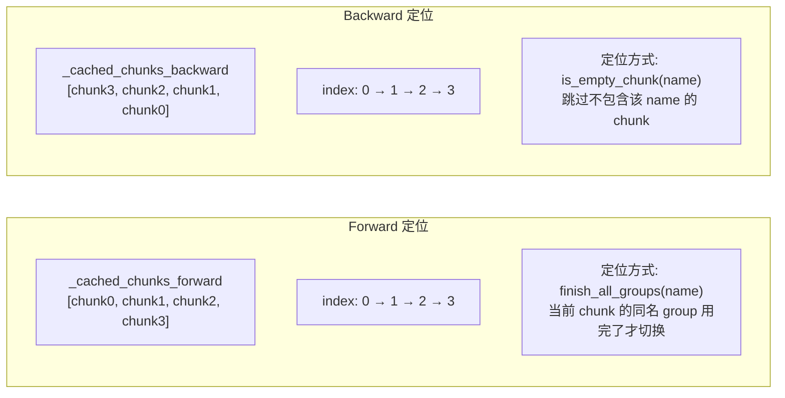

| 维度 | Forward Chunk | Backward Chunk |
|------|---------------|----------------|
| **列表** | `_cached_chunks_forward` (正序) | `_cached_chunks_backward` (逆序) |
| **指针** | `_cached_chunks_index_forward` | `_cached_chunks_index_backward` |
| **当前 chunk** | `_cur_forward_chunk` | `_cur_backward_chunk` |
| **切换触发** | `finish_all_groups(name)` = True | `on_group_commit_backward` 中发现 `cur != self` |
| **切换方法** | `pop_forward_chunk(name)` 内部 while 循环 | `pop_backward_chunk(name)` 显式调用 |
| **peek 方法** | `cur_forward_chunk()` | `front_backward_chunk(name)` |
| **切换判断** | 当前 chunk 中同名 group 全部处理完 | 找到第一个包含该 name 的非空 chunk |

## 六、一句话总结

- **Forward chunk**：按正序遍历，靠 `finish_all_groups(name)` 判断"当前 chunk 的同名 group 是否全部消费完"来决定是否切换到下一个 chunk
- **Backward chunk**：按逆序遍历，靠 `is_empty_chunk(name)` 跳过不含目标 group 的 chunk，在 `on_group_commit_backward` 中通过 `self != cur_backward_chunk` 触发 `pop_backward_chunk` 切换

[任务规划完成]
对！你说得很对，让我重新审视这个 `while` 循环的逻辑：

```python
while not self._is_warmup and (
    self._cur_forward_chunk is None or self._cur_forward_chunk.finish_all_groups(name)
):
    if self._cached_chunks_index_forward >= len(self._cached_chunks_forward):
        self._cur_forward_chunk = None
        break
    self._cur_forward_chunk = self._cached_chunks_forward[self._cached_chunks_index_forward]
    self._cached_chunks_index_forward += 1
```

循环条件是 `finish_all_groups(name) == True` 时**继续循环**，`False` 时**退出循环**。

## 所以逻辑是这样的

1. **`finish_all_groups(name)` 返回 True** → "这个 chunk 里没有名为 `name` 的 group 需要处理了" → **跳过这个 chunk，继续取下一个**
2. **`finish_all_groups(name)` 返回 False** → "这个 chunk 里还有名为 `name` 的 group 要处理" → **停下来，用这个 chunk**

## 关键场景：不是每个 chunk 都包含同名 group

这个 while 循环存在的意义是：**不同的 chunk 里可能有不同的 group 名称组合**。

比如在 VPP（Virtual Pipeline Parallelism）场景下，不同 vpp_rank 的 chunk 可能对应不同的模型层，它们的 group 结构可能不同。当你用 `pop_forward_chunk("attn")` 去找下一个要处理 `"attn"` 的 chunk 时：

```
chunk0: [attn, mlp, attn, mlp]  ← 有 attn，停在这里
chunk1: [embed_only]            ← 没有 attn，跳过
chunk2: [attn, mlp, attn, mlp]  ← 有 attn，停在这里
```

## 另一个关键场景：当前 chunk 的同名 group 已经全部处理完

假设 chunk0 有 `[attn, mlp, attn, mlp]`，forward 过程中 4 个 group 都处理完了（`_offloaded_group_index = 4`）。下一次 `pop_forward_chunk("attn")` 时：

```
chunk0.finish_all_groups("attn")
→ find_group_with_name("attn", 4)  // 从 index 4 开始找
→ 没有了 → return True
→ 继续循环，取 chunk1
```

## 总结

这个 while 循环本质上是一个**按 group 名称定位 chunk** 的过程：

- **True（继续循环）**：当前 chunk 要么是 None，要么已经没有叫 `name` 的 group 了 → 不适合，换下一个
- **False（退出循环）**：当前 chunk 里还有叫 `name` 的 group 等着处理 → 就是它了

所以 `finish_all_groups` 的命名其实是 "**是否已经 finish 了所有（同名的）groups**"，返回 True 意味着"活干完了"，循环就继续找下一个有活干的 chunk。
