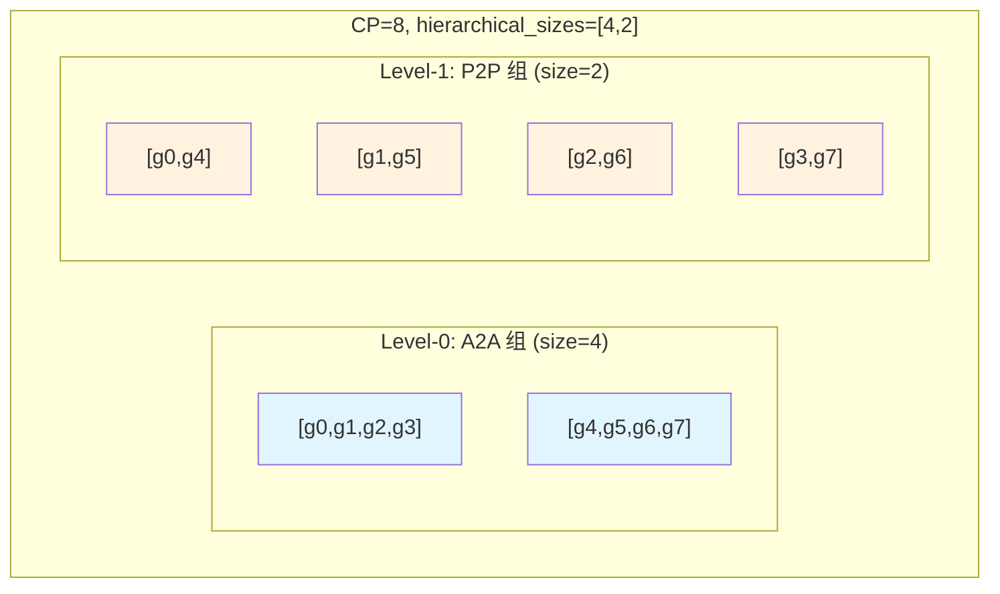
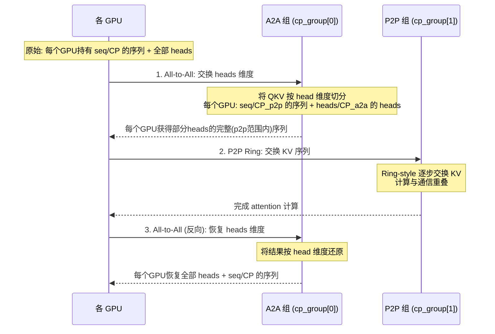

---
title: Megatron-LM 新感悟
layout: default
category: megatron
---
### ParallelState

`order` 参数定义了各并行维度从**内层（变化最快）到外层（变化最慢）**的排列顺序。不同的 order 会让同一个物理 rank 属于不同的并行组。

#### 8 GPU, tp=2, ep=2, dp=1, pp=2

**`tp-ep-dp-pp`**（tp 最内层，pp 最外层）：

```
Rank布局 (pp, dp, ep, tp):
Rank0: pp=0, ep=0, tp=0    Rank4: pp=1, ep=0, tp=0
Rank1: pp=0, ep=0, tp=1    Rank5: pp=1, ep=0, tp=1
Rank2: pp=0, ep=1, tp=0    Rank6: pp=1, ep=1, tp=0
Rank3: pp=0, ep=1, tp=1    Rank7: pp=1, ep=1, tp=1

tp组: [0,1] [2,3] [4,5] [6,7]   ← 相邻rank
pp组: [0,4] [1,5] [2,6] [3,7]   ← 跨距4
ep组: [0,2] [1,3] [4,6] [5,7]   ← 跨距2
```

**`tp-pp-ep-dp`**（tp 最内层，dp 最外层）：

```
Rank布局 (dp, ep, pp, tp):
Rank0: ep=0, pp=0, tp=0    Rank4: ep=1, pp=0, tp=0
Rank1: ep=0, pp=0, tp=1    Rank5: ep=1, pp=0, tp=1
Rank2: ep=0, pp=1, tp=0    Rank6: ep=1, pp=1, tp=0
Rank3: ep=0, pp=1, tp=1    Rank7: ep=1, pp=1, tp=1

tp组: [0,1] [2,3] [4,5] [6,7]   ← 还是一样的！
pp组: [0,2] [1,3] [4,6] [5,7]   ← 变了！跨距2
ep组: [0,4] [1,5] [2,6] [3,7]   ← 变了！跨距4
```

为什么 tp 和 cp 不变？

- **tp 始终是最内层维度**（order 字符串中 tp 总是第一个），所以 tp 组总是由相邻 rank 组成，不受后续维度排列影响。
- **cp 的相对位置也没变**（两种 order 中 cp 都在 tp 之后），所以 cp 组也不变。

为什么 pp/ep/dp/mp/amax 变了？

这些维度在 order 中的**相对位置发生了交换**，导致它们在 rank 空间中的跨距改变了，同一组内包含的 rank 就不同了。

实际意义

- `tp-ep-dp-pp`：pp 在最外层 → pp 通信跨节点 → 适合 pipeline 通信走 IB 网卡
- `tp-pp-ep-dp`：dp 在最外层 → dp 通信跨节点 → 适合 allreduce 通信走 IB 网卡

选择哪个 order 取决于你的集群拓扑和哪种通信模式更频繁/更值得优化。


#### 8 GPU, tp=2, ep=1, dp=2, pp=2

**`tp-ep-dp-pp`**（内→外：tp → ep → dp → pp）：

```
rank = pp*4 + dp*2 + ep*2 + tp  (ep=1 时 ep*2=0)

pp=0,dp=0: [0,1]   pp=1,dp=0: [4,5]
pp=0,dp=1: [2,3]   pp=1,dp=1: [6,7]

tp组: [0,1] [2,3] [4,5] [6,7]
dp组: [0,2] [1,3] [4,6] [5,7]   ← dp 和 pp 在相邻层，跨距=tp*ep=2
pp组: [0,4] [1,5] [2,6] [3,7]   ← pp 最外层，跨距=tp*ep*dp=4
```

**`tp-pp-ep-dp`**（内→外：tp → pp → ep → dp）：

```
rank = dp*4 + ep*2 + pp*2 + tp  (ep=1 时 ep*2=0)

dp=0,pp=0: [0,1]   dp=1,pp=0: [4,5]
dp=0,pp=1: [2,3]   dp=1,pp=1: [6,7]

tp组: [0,1] [2,3] [4,5] [6,7]   ← 不变
dp组: [0,4] [1,5] [2,6] [3,7]   ← 变了！dp 最外层，跨距=tp*ep*pp=4
pp组: [0,2] [1,3] [4,6] [5,7]   ← 变了！pp 和 tp 相邻，跨距=tp=2
```

对比总结

| 并行组 | `tp-ep-dp-pp` | `tp-pp-ep-dp` | 是否变化 |
| ------ | ------------- | ------------- | -------- |
| tp     | 跨距1         | 跨距1         | 不变     |
| dp     | 跨距2         | 跨距4         | **变**   |
| pp     | 跨距4         | 跨距2         | **变**   |

本质就是 **dp 和 pp 交换了在嵌套顺序中的位置**，导致它们的跨距互换了。谁更靠外层，谁的跨距就更大（组内 rank 在物理上分布更分散，跨节点通信更多）。

#### **16 GPU, tp=2, pp=2, cp=2, ep=1**

 → `dp = 16/(2×2×2) = 2`

 **`tp-cp-dp-pp`** 顺序（tp 最内层，pp 最外层）下的分组逻辑。用 16 GPU 例子走一遍：

```
rank = pp×8 + dp×4 + cp×2 + tp

         tp=0  tp=1
pp=0 dp=0 cp=0: [0]   [1]
pp=0 dp=0 cp=1: [2]   [3]
pp=0 dp=1 cp=0: [4]   [5]
pp=0 dp=1 cp=1: [6]   [7]
pp=1 dp=0 cp=0: [8]   [9]
pp=1 dp=0 cp=1: [10]  [11]
pp=1 dp=1 cp=0: [12]  [13]
pp=1 dp=1 cp=1: [14]  [15]
```

---

1. tp_group — Tensor并行组

同 (pp, dp, cp)，相邻 rank

```
[0,1] [2,3] [4,5] [6,7] [8,9] [10,11] [12,13] [14,15]
```
跨距=1，最紧密的通信，通常在同一节点内。

---

2. cp_group — Context并行组

```
pp=0 dp=0: [0,2] [1,3]     ← rank0↔rank2 间隔2
pp=0 dp=1: [4,6] [5,7]
pp=1 dp=0: [8,10] [9,11]
pp=1 dp=1: [12,14] [13,15]
```
跨距=tp=2。用于切分序列长度，组内通信交换序列块。

---

3. dp_group — Data并行组（不含cp）

```
pp=0: [0,4] [1,5] [2,6] [3,7]     ← 跨距=tp×cp=4
pp=1: [8,12] [9,13] [10,14] [11,15]
```
跨距=4。用于 allreduce 梯度同步，**不含 cp 维度**。

---

4. dp_groups_with_cp — Data并行组（含cp）

```
pp=0: [0,2,4,6] [1,3,5,7]         ← 跨距=tp=2
pp=1: [8,10,12,14] [9,11,13,15]
```
跨距=2。把 cp 和 dp 合并做 allreduce，减少通信次数。

---

5. pp_group — Pipeline并行组

```
[0,8] [1,9] [2,10] [3,11] [4,12] [5,13] [6,14] [7,15]
```
跨距=tp×cp×dp=8。pipeline 通信在最外层，**跨距最大**。

---

6. mp_group — Model并行组 (tp+pp)

```
[0,1,8,9]  [2,3,10,11]  [4,5,12,13]  [6,7,14,15]
```
从 dp_with_cp 中取每个组的第 i 个元素拼起来。

---

7. tp_dp_group — Tensor+Data并行组（不含cp）

```
pp=0 cp=0: [0,1,4,5]      ← tp组[0,1] + tp组[4,5]
pp=0 cp=1: [2,3,6,7]
pp=1 cp=0: [8,9,12,13]
pp=1 cp=1: [10,11,14,15]
```
用于 tp+dp 联合操作（如 all-reduce all-gather）。

---

8. tp_dp_cp_group — Tensor+Data+Context并行组

**同 pp，跨 (tp, dp, cp) 维度**

```
pp=0: [0,1,2,3,4,5,6,7]
pp=1: [8,9,10,11,12,13,14,15]
```
一个 pipeline stage 内的所有 rank。


#### 64节点 × 8GPU = 512 GPU, tp=4, pp=2, cp=8, ep=8

**好像CP和EP 的size，要么一样，要么其中一个为1，**

**Dense和Expert的grad通信组不一样**

```
dp = 512 / (4×2×8) = 8
expert_dp = 512 / (4×8×2) = 8
```

Dense模块的order==tp-cp-dp-pp==

```
rank = pp×256 + dp×32 + cp×4 + tp
```

**Rank 布局**（每个块内 32 个 rank）：

```
pp=0:
  dp=0: cp0[0,1,2,3]  cp1[4,5,6,7]  ...  cp7[28,29,30,31]
  dp=1: cp0[32,33,34,35]  cp1[36,37,38,39]  ...  cp7[60,61,62,63]
  ...
  dp=7: cp0[224,...,227]  ...  cp7[252,253,254,255]

pp=1:
  dp=0: cp0[256,...,259]  ...  cp7[284,...,287]
  ...
  dp=7: cp0[480,...,483]  ...  cp7[508,509,510,511]
```

---

各通信组

| 通信组         | 条件         | 跨距          | 组大小       | 组数 | 示例                                        |
| -------------- | ------------ | ------------- | ------------ | ---- | ------------------------------------------- |
| **tp**         | 同(pp,dp,cp) | 1             | 4            | 128  | `[0,1,2,3]` `[4,5,6,7]`                     |
| **cp**         | 同(pp,dp,tp) | tp=4          | 8            | 64   | `[0,4,8,12,16,20,24,28]`                    |
| **dp**         | 同(pp,cp,tp) | tp×cp=32      | 8            | 64   | `[0,32,64,...,224]`                         |
| **dp_with_cp** | 同(pp,tp)    | tp=4          | dp×cp=64     | 8    | `[0,4,8,...,252]`                           |
| **pp**         | 同(dp,cp,tp) | tp×cp×dp=256  | 2            | 256  | `[0,256]` `[1,257]`                         |
| **mp**         | 同(dp,cp)    | tp内1,pp间256 | tp×pp=8      | 64   | `[0,1,2,3,256,257,258,259]`                 |
| **tp_dp**      | 同(pp,cp)    | —             | tp×dp=32     | 16   | `[0,1,2,3,32,33,34,35,...,224,225,226,227]` |
| **tp_dp_cp**   | 同pp         | —             | tp×dp×cp=256 | 2    | `[0..255]` `[256..511]`                     |

---

mp_group 详细构造

从 dp_with_cp 组中取第 i 个元素拼起来：

```
dp_with_cp(pp=0): [0,4,8,...,252]  [1,5,9,...,253]  [2,6,10,...,254]  [3,7,11,...,255]
dp_with_cp(pp=1): [256,260,...,508] [257,...,509]    [258,...,510]     [259,...,511]

i=0 → [0, 1, 2, 3,   256, 257, 258, 259]     ← dp=0, cp=0 的所有 tp+pp rank
i=1 → [4, 5, 6, 7,   260, 261, 262, 263]     ← dp=0, cp=1
i=2 → [8, 9, 10, 11, 264, 265, 266, 267]     ← dp=0, cp=2
...
i=7 → [28,29,30,31,  284,285,286,287]         ← dp=0, cp=7
i=8 → [32,33,34,35,  288,289,290,291]         ← dp=1, cp=0
...
i=63 → [252,253,254,255, 508,509,510,511]     ← dp=7, cp=7
```

---

Expert 模块的order：==tp-ep-dp-pp==

expert 用独立布局 `(pp=2, expert_dp=8, ep=8, tp=4)`：

**expert_tp_ep_group**：reshape 为 `(16, 32)`，同 (pp, expert_dp)，跨 (ep, tp)

```
rank = pp×(expert_dp×ep×tp) + expert_dp×(ep×tp) + ep×tp + tp
     = pp×256 + expert_dp×32 + ep×4 + tp
```

```
pp=0,edp=0: [0,1,2,3, 4,5,6,7, ..., 28,29,30,31]   ← 32 ranks (ep=8 × tp=4)
pp=0,edp=1: [32,...,63]
...
pp=1,edp=7: [480,...,511]
共 16 组
```

**expert_dp_group**：permute 为 `(pp, ep, tp, expert_dp)` reshape 为 `(64, 8)`

```
pp=0,ep=0,tp=0: [0, 32, 64, 96, 128, 160, 192, 224]   ← 跨 expert_dp，8 ranks
pp=0,ep=0,tp=1: [1, 33, 65, ...]
...
pp=1,ep=7,tp=3: [259, 291, 323, ...]
共 64 组
```

---

跨距与物理拓扑对应

| 维度 | 跨距 | 物理含义                   |
| ---- | ---- | -------------------------- |
| tp=4 | 1    | 节点内 4 GPU               |
| cp=8 | 4    | 节点内同一 DP 下的 8 组    |
| dp=8 | 32   | 跨 4 节点（32/8=4）        |
| pp=2 | 256  | **跨 32 节点**（256/8=32） |

64 节点集群中，pp 通信跨越 32 个节点，dp 通信跨越 4 个节点，tp/cp 完全在节点内。这就是 `tp-cp-dp-pp` 顺序的设计意图：**通信量大的 tp/cp 放节点内，通信量小的 pp 放节点间**。


#### expert_tensor_parallel_size

`expert_tensor_parallel_size` 确实可以让 dense 和 expert 的 tp 不同。回到 `parallel_state.py` 中的逻辑：

```python
if expert_tensor_parallel_size is None:
    expert_tensor_parallel_size = tensor_model_parallel_size

expert_tensor_model_pipeline_parallel_size = (
    expert_tensor_parallel_size * expert_model_parallel_size * pipeline_model_parallel_size
)
expert_data_parallel_size = world_size // expert_tensor_model_pipeline_parallel_size
```

它决定了 **expert 的模型并行度**（etp × ep × pp），从而间接决定了 **expert data parallel size**：

```
dp = world_size / (etp_size × ep_size × pp_size)
expert_dp  = world_size / (tp_size × pp_size × cp_size)
```

==不强制dp == expert_dp==

`expert_tensor_parallel_size` 的真正用途是：**让 routed expert 和 non-expert 可以有不同的 TP 度**。比如 attention 用 TP=4，但 expert 用 TP=1（因为routed expert 通常很小，不值得做 TP），这样 EP 可以更大。

**`SharedExpertMLP` 使用的是 `pg_collection.tp`（普通 TP 组），而不是 `pg_collection.expt_tp`（expert TP 组）。**

所以 **`expert_tensor_parallel_size` 不影响共享专家**。

共享专家（shared expert）不是一个"被 EP 分片的 expert"，而是一个**所有 token 都会经过的完整 MLP**。它的语义更接近 attention 层：

- 权重在 **TP 组**内做切分（跟 attention 一样）
- 不参与 EP 的 all-to-all 通信
- 通信模式是标准的 TP all-gather / reduce-scatter

而 `expert_tensor_parallel_size` 只影响 **routed experts** 的 TP 组（`expt_tp`），用来控制 expert 部分的模型并行度和 expert DP size。

所以共享专家的 TP 切分始终跟 attention 层保持一致（`tp_group`），不受 `expert_tensor_parallel_size` 影响。


#### Hybrid DP : intra + inter

计算方式很简单，两组公式对称：

Dense (dp_cp)

```python
# parallel_state.py:839-841
intra_partial_data_parallel_size = (dp_size * cp_size) // num_distributed_optimizer_instances
```

Expert (edp)

```python
# parallel_state.py:1267-1268
intra_partial_expert_data_parallel_size = edp_size // num_distributed_optimizer_instances
```

注意 dense 那边乘了 `cp_size`，expert 没乘，因为 expert 不做 CP（context parallel），expert 的数据并行组本身就只有 `edp_size`。

假设 `dp_size=16, cp_size=1, edp_size=16, num_instances=4`：

| 组                     | size         | 组成                        |
| ---------------------- | ------------ | --------------------------- |
| `dp_cp_group`          | 16           | 全部 DP×CP rank             |
| `intra_dp_cp_group`    | 16/4 = **4** | 每个 instance 内的 rank     |
| `inter_dist_opt_group` | **4**        | 跨 instance 的对应 rank     |
| `expt_dp_group`        | 16           | 全部 edp rank               |
| `intra_expt_dp_group`  | 16/4 = **4** | 每个 instance 内的 edp rank |

验证：`intra_size × num_instances = dp_cp_size`，即 `4 × 4 = 16` ✓


### Hybrid  CP ✅

#### 设计 ✅

```python
hybrid_context_parallel: bool = False
```

**作用：** 设为 `True` 时，启用混合上下文并行，让不同长度的 packed sample 使用不同数量的 CP GPU，以实现负载均衡。

**使用条件：**
- 必须同时设置 `max_seqlen_per_dp_cp_rank`（每个 DP×CP rank 能处理的最大序列长度），因为调度器需要这个值来计算每个样本需要多少个 CP GPU（`gpus_needed()` 就是用 `seq_len / max_seq_len_per_rank` 来算的）

**适用场景：**
- 训练数据是 packed samples（多个样本打包在一起），且**序列长度差异大**
- 如果所有样本长度差不多，普通 CP 就够了，不需要 hybrid CP

**三者关系：**

| 配置                           | 作用                                                   |
| ------------------------------ | ------------------------------------------------------ |
| `hybrid_context_parallel=True` | 开启混合 CP 调度                                       |
| `max_seqlen_per_dp_cp_rank`    | 告诉调度器单卡能处理多长的序列，决定每个样本的 CP size |
| `BalancedCPScheduler`          | 实际执行负载均衡分配的调度器                           |

---

**问题一：谁来做统筹调度？其他 rank 怎么知道该缩小/扩大 CP？**

**答案：所有 rank 看到相同数据，运行相同的确定性调度器，自然达成一致。**

完整流程在 `HybridCPDataLoaderWrapper.__next__()` 中：

```
每个 DP rank 各自拿到一批 packed samples
        │
        ▼
all_gather 各 rank 的子样本序列长度 (get_global_seqlens)
  → 每个 rank 都有全局所有子样本的 (global_id, seqlen)
        │
        ▼
每个 rank 独立运行 BalancedCPScheduler.get_groups_and_subsamples()
  → 输入是按 seqlen 降序排列的全局列表（确定性排序）
  → 调度算法是确定性的贪心 → 所有 rank 得到完全相同的调度结果
        │
        ▼
reroute_samples_to_hdp_ranks() 用 all_to_all 把数据搬到目标 rank
```

关键点：**不需要任何额外协调通信**。因为：
1. 每个 rank 的 `seqlens_gathered` 相同
2. 排序是确定性的（按 seqlen 降序）
3. 贪心算法是确定性的

所有 rank 对"哪个样本分配给哪组 GPU"达成共识，然后 all-to-all 搬运数据。

---

**问题二：hybrid CP 的 forward_backward vs 普通 forward_backward_no_pipelining 的区别**

对比两者核心逻辑：

```
┌─────────────── forward_backward_no_pipelining ───────────────┐
│                                                               │
│  with no_sync:                                                │
│    for i in range(num_microbatches - 1):     ← 固定微批数    │
│      forward_step(data_iterator, ...)        ← 同一迭代器    │
│      backward_step(...)                                       │
│                                                               │
│  forward_step(data_iterator, ...)             ← 最后一个     │
│  backward_step(...)                          ← 触发规约      │
└───────────────────────────────────────────────────────────────┘

┌──────── hybrid_context_parallel_forward_backward ────────────┐
│                                                               │
│  ① 数据获取方式不同                                           │
│     TP rank 0 从 data_iterator 取 (batch, sample_id_groups) │
│     广播 num_samples_this_group 给其他 TP rank               │
│                                                               │
│  ② 按组调度，而非简单循环微批次                                │
│  with no_sync:                                                │
│    for group j in range(N-1):                 ← 按组遍历     │
│      for sub-sample i in group[j]:            ← 每组不同子样本│
│        new_data = _get_new_data_iterator(i,j) ← 每子样本独立 │
│        forward_step(new_data, ...)                            │
│        backward_step(...)                                     │
│      barrier(dp_cp_group)                     ← 组间同步！   │
│                                                               │
│  with no_sync:                                                │
│    for i in range(last_group - 1):                            │
│      forward_step / backward_step                             │
│                                                               │
│  forward_step / backward_step                 ← 最后一子样本  │
│                                             ← 触发规约       │
└───────────────────────────────────────────────────────────────┘
```

**核心差异总结：**

| 维度       | 普通 no_pipelining        | hybrid CP                              |
| ---------- | ------------------------- | -------------------------------------- |
| 微批次来源 | `data_iterator` 直接迭代  | `HybridCPDataLoaderWrapper` 调度后返回 |
| CP 大小    | 固定（`cp_group.size()`） | 每个子样本不同（`local_cp_size`）      |
| 数据迭代器 | 一个共用                  | 每个子样本独立 `RerunDataIterator`     |
| 同步点     | 无（只有末尾梯度规约）    | **组间 barrier**（切换 CP 子组大小）   |
| 调度信息   | 无需                      | TP rank 0 → 广播给其他 TP rank         |
| 循环结构   | 按 microbatch 编号        | 按 group → 按 sub-sample               |

组间 barrier 是最关键的新增：因为不同组的 CP 子组大小不同，rank 的 CP 伙伴关系会变，必须同步后才能切换。

---

**问题三：CP 扩张是跨 DP 维度抢 GPU 吗？**

**是的，正是如此。** 这就是 "Hybrid" 的含义——CP 和 DP 之间的边界是动态的。

通信组的预创建

看 `create_hybrid_dp_cp_groups`（parallel_state.py L422-444）：

```python
# 假设 DPxCP 组有 8 个 rank: [0,1,2,3,4,5,6,7]
group_sizes = [2, 4, 8]  # 每个 2 的幂

# 预创建所有可能的子组：
# CP=2: [0,1], [2,3], [4,5], [6,7]
# CP=4: [0,1,2,3], [4,5,6,7]  
# CP=8: [0,1,2,3,4,5,6,7]
```

这些 NCCL 通信组在初始化时就全部建好了，运行时只是选择用哪个。

具体场景举例

假设原始配置 DP=2, CP=4，DPxCP 组 = `[g0,g1,g2,g3,g4,g5,g6,g7]`：

```
场景1: 所有样本都很长（需要 CP=8）
┌─────────────────────────────────┐
│  CP=8: [g0,g1,g2,g3,g4,g5,g6,g7] │  ← 整个 DPxCP 组做 CP
│  DP 退化为 1                        │  ← 原本 DP=2 现在没了
└─────────────────────────────────┘

场景2: 混合长短样本
┌──────────────────┐  ┌───────┐
│ CP=4: [g0..g3]   │  │CP=2:  │   ← g4,g5 处理短样本
│ 长样本A          │  │[g4,g5]│
└──────────────────┘  └───────┘
                       ┌───────┐
                       │CP=2:  │   ← g6,g7 处理另一个短样本
                       │[g6,g7]│
                       └───────┘

场景3: 所有样本都很短（只需 CP=2）
┌─────┐ ┌─────┐ ┌─────┐ ┌─────┐
│CP=2 │ │CP=2 │ │CP=2 │ │CP=2 │   ← 相当于 DP=4, CP=2
│[0,1]│ │[2,3]│ │[4,5]│ │[6,7]│   ← DP 维度扩张了！
└─────┘ └─────┘ └─────┘ └─────┘
```

`fill_empty_gpus` 正是"抢 GPU"的逻辑

当调度完发现有空闲 GPU 时（L345-437），它会递归地把最小 CP 组扩大一倍：

```
原来是 CP=2: [g0,g1] 有工作，g2-g7 空闲
  → 把 g0,g1 的样本扩展到 CP=4: [g0,g1,g2,g3]
  → 现在 g4-g7 空闲
  → 再扩展到 CP=8: [g0,...,g7]
  → 没有空闲 GPU 了
```

这个过程中，**GPU 从"做 DP"变成了"做 CP"**——本来 g2,g3 是独立的 DP 副本，现在被拉进 CP 组分担序列维度。

一句话总结

> **Hybrid CP 的本质就是：DPxCP 组内的 GPU 既可以做 DP（不同数据），也可以做 CP（同数据不同序列段），调度器根据样本长度动态决定每个 GPU 当前角色。长样本多拉几个 GPU 做 CP，短样本少用 CP 多留 GPU 做 DP。**


**一个关键约束：CP 组大小必须是 2 的幂次，不能是任意数。**

✅==**你的理解**：CP组大小可以任意混合，比如一个组6个GPU，一个组2个GPU。== 

**Megatron的实际实现**：CP组大小**必须是2的幂次**（1, 2, 4, 8, 16...），不能是6。

看关键代码 `hybrid_cp_schedule.py:44-53`：

```python
def gpus_needed(self, seq_len: int) -> int:
    """
    The number is rounded up to the next power of 2 to match the available
    hybrid context parallel process group sizes.
    """
    return max(1, 2 ** ceil(log2((seq_len / self.max_seq_len_per_rank))))
```

**向上取整到最近的2的幂**。这是因为 NCCL 通信组（`create_hybrid_dp_cp_groups`）只预创建2的幂次大小的进程组。

所以实际场景是这样的

假设8个GPU组成一个 DP×CP 组，`max_seq_len_per_rank = 4096`：

| 样本序列长度 | gpus_needed()                              | CP组大小 |
| ------------ | ------------------------------------------ | -------- |
| 3000         | `2^ceil(log2(3000/4096))` = `2^0` = **1**  | 1 (纯DP) |
| 5000         | `2^ceil(log2(5000/4096))` = `2^1` = **2**  | 2        |
| 9000         | `2^ceil(log2(9000/4096))` = `2^2` = **4**  | 4        |
| 15000        | `2^ceil(log2(15000/4096))` = `2^2` = **4** | 4        |

8个GPU的分配示例：
- 一个样本需要CP=4 → GPU 0-3 组成CP组处理长数据
- 剩下GPU 4-7 可以分成两组CP=2 → 各处理短数据

**本质上你的理解是对的**：长数据用大CP组，短数据用小CP组（甚至CP=1即纯DP）。只是CP大小不能是3、5、6这种非2幂次，必须是1/2/4/8/16...

这个约束来自 ring-attention/all-gather 等CP通信模式需要2的幂次才能均匀切分序列。


#### 混合 CP 的数据加载流程

**不是每个 rank 拿到全部数据，也不是传统 DP 那样每个 rank 只拿自己那份不管别的。**

流程分 5 步（对应 `HybridCPDataLoaderWrapper.__next__`）：

1. 各 DP rank 各自加载一批数据

```
DP rank 0 拿到: [s0(len=8K), s1(len=2K), s2(len=4K)]
DP rank 1 拿到: [s3(len=1K), s4(len=6K), s5(len=3K)]
```
每个 DP rank 拿到的数据量相同，但子样本的长度分布可能不均衡。

2. All-gather 全局序列长度

`get_global_seqlens()` 把所有 DP rank 的子样本长度 gather 到一起：
```
全局: [(g0,8K), (g1,2K), (g2,4K), (g3,1K), (g4,6K), (g5,3K)]
```
**注意**：只 gather 了长度信息（int32），不是实际数据，通信量很小。

3. 本地调度（所有 rank 算法一致，结果一致）

`BalancedCPScheduler.get_groups_and_subsamples()` 用贪心算法分配，**每个 rank 独立运行相同的调度**，但输入一样所以结果一样：
```
组0: GPU[0-3]处理g0(CP=4), GPU[4-7]处理g4(CP=4)
组1: GPU[0-1]处理g2(CP=2), GPU[2-3]处理g5(CP=2), GPU[4-5]处理g1(CP=2), GPU[6-7]处理g3(CP=2)
```

4. All-to-all 重路由数据

`reroute_samples_to_hdp_ranks()` —— 这才是关键：

调度结果可能让 DP rank 0 上的 g0（8K 长数据）分配给 GPU[0-3]，而 g4（原本在 DP rank 1）也分配给 GPU[4-7]。所以需要**跨 rank 传输实际数据**：

```
DP rank 0 原本持有 g0, g1, g2
DP rank 1 原本持有 g3, g4, g5

调度后:
  GPU0 需要 g0  → 从 rank 0 本地拿
  GPU4 需要 g4  → 从 rank 1 通过 all-to-all 拿
```

用 `torch.distributed.all_to_all_single` 按调度结果把实际样本数据搬到对应的 GPU 上。

5. 返回

返回 `(samples_this_rank_with_id, sample_id_groups)`，前者是当前 rank 需要处理的实际数据，后者是调度元数据。

和传统 DP 的区别

|          | 传统 DP                    | 混合 CP                                |
| -------- | -------------------------- | -------------------------------------- |
| 数据加载 | 各 rank 独立拿自己的 batch | 各 rank 独立拿，但会 all-to-all 重分配 |
| 调度     | 不需要全局调度             | 需要 all-gather 长度 + 全局贪心调度    |
| 数据传输 | 无（各算各的）             | all-to-all 跨 rank 搬运样本            |
| 目的     | 数据并行                   | 负载均衡（长数据多用 CP 分摊）         |

**核心区别**：传统 DP 是"拿什么算什么"，混合 CP 是"先拿，再根据长度全局调度，再搬数据到该去的 GPU"。多了一层调度和重路由。


#### hybrid_context_parallel_forward_backward

---

整体三阶段架构

```python
┌─────────────────────────────────────────────────────────────┐
│  阶段0：数据获取 + 调度元数据构建                                │
├─────────────────────────────────────────────────────────────┤
│  阶段1：with no_sync():                                      │
│    for group j in [0, N-2]:                                 │
│      for sub-sample in group[j]:  forward → backward        │
│      barrier(dp_cp_group)                                   │
├─────────────────────────────────────────────────────────────┤
│  阶段2：with no_sync():                                      │
│    for sub-sample in [0, K-2] of last_group:  forward→backward│
├─────────────────────────────────────────────────────────────┤
│  阶段3：（no_sync 外）                                        │
│    last sub-sample of last_group:  forward → backward       │
│    → 触发梯度 all-reduce                                     │
└─────────────────────────────────────────────────────────────┘
```

---

**为什么需要 barrier？**

- 不同组可能使用不同 CP 子组大小
- GPU 的 CP 伙伴在组边界会变化
- 没有 barrier → 某 rank 提前进入下一组，其 CP 伙伴还在当前组 → **死锁**

**为什么要拆分最后一组？**

- `no_sync_func()` 延迟梯度 reduce，退出上下文时才触发
- 希望所有子样本梯度累积完毕后只做 **一次** reduce
- 所以只有最后一个子样本在 no_sync 外执行 → 退出时立即触发 reduce

数据流向图

```python
HybridCPDataLoaderWrapper
    │ (all-to-all 已完成数据路由)
    ▼
batch + sample_id_groups
    │
    ├─→ TP rank 0: 直接访问
    └─→ TP rank 1+: 通过 _broadcast 获取 num_samples_this_group
                    数据通过 forward_step 内 TP 广播获取
    │
    ▼
for each group j:
    for each sub-sample i:
        _get_new_data_iterator(i, j)
            │
            ├─ 查找 sub_sample_id
            ├─ 获取 sample 数据
            ├─ 计算 local_cp_size (partner_cp_size)
            └─ 包装为 RerunDataIterator
                │
                ▼
        forward_step ──→ backward_step
            │                │
            │                └─→ 梯度累积（no_sync 内）
            │                    或 触发 all-reduce（no_sync 外，仅阶段3）
            ▼
        output_tensor → forward_data_store
```


---

#### Attention 层感知 CP Group 改变的完整链路

追踪 `local_cp_size` 从注入到 Attention 层消费的完整链路。
现在我可以完整回答这个问题了。核心机制是通过 **`local_cp_size` → `PackedSeqParams` → 动态切换 CP ProcessGroup** 来实现的。

**问题本质**

Hybrid CP 中，不同子样本需要不同的 CP 大小（比如长序列 CP=4，短序列 CP=2），但 Attention 层在初始化时绑定了一个固定的 CP group。**如何让同一个 Attention 层在运行时动态切换 CP 通信组？**

**完整数据流**

```python
① 调度阶段（hybrid_cp_schedule.py:640-645）
─────────────────────────────────────────────
sample["local_cp_size"] = torch.tensor(partner_cp_size)
    │   partner_cp_size = 统计 sample_id_groups[j] 中有多少 GPU 共享同一子样本
    │   例：GPU0,1 都有 s0 → partner_cp_size = 2
    │       GPU0,1,2,3 都有 sA → partner_cp_size = 4
    ▼

② 前向数据准备（pretrain_gpt.py:83-95）
─────────────────────────────────────────
local_cp_size = batch.pop('local_cp_size', None)    # 取出标量
local_cp_size = int(local_cp_size.item())            # int32 → int
    │
    ▼
batch, packed_seq_params = get_batch_on_this_hybrid_cp_rank(batch, local_cp_size)

③ 构建 PackedSeqParams（utils.py:2086-2132）
─────────────────────────────────────────────
if local_cp_size > 1:
    cp_group = parallel_state.get_hybrid_data_context_parallel_groups(
        group_size=local_cp_size     # ← 按 local_cp_size 查找对应 ProcessGroup
    )

packed_seq_params = PackedSeqParams(
    ...
    local_cp_size=local_cp_size,    # CP 大小
    cp_group=cp_group,              # 对应的通信组
)

if cp_group.size() > 1:
    batch = get_batch_on_this_cp_rank(batch, cp_group=cp_group)
    # ↑ 按序列维度切片，将序列分给 CP rank
    ▼

④ Attention 层动态切换（transformer_engine.py:1345-1363）
──────────────────────────────────────────────────────────
def forward(self, query, key, value, ..., packed_seq_params=None):
    if packed_seq_params is not None:
        if packed_seq_params.cp_group is not None:
            # ★ 关键：动态替换 TE 内部的 CP 通信组
            self.cp_group = packed_seq_params.cp_group
            super().set_context_parallel_group(
                self.cp_group,                              # 新 ProcessGroup
                torch.distributed.get_process_group_ranks(self.cp_group),
                TEDotProductAttention.cp_stream,
                self.cp_comm_type,
            )
        elif packed_seq_params.local_cp_size is not None:
            # local_cp_size == 1 且无 cp_group → 动态关闭 CP
            assert packed_seq_params.local_cp_size == 1
            super().set_context_parallel_group(None, None, None, self.cp_comm_type)
```

ProcessGroup 预创建机制

关键前提：**所有可能的 CP group 在初始化时就已经预创建好了**。

```python
# parallel_state.py:422-444
def create_hybrid_dp_cp_groups(rank, ranks, pg_options):
    """为每个 2 的幂次大小创建 NCCL ProcessGroup"""
    hybrid_dp_cp_groups = {}
    group_sizes = [2**i for i in range(int(log2(len(ranks))))][1:]
    # 例：8 个 DPxCP rank → group_sizes = [2, 4, 8]
    
    for group_size in group_sizes:
        for i in range(0, len(ranks), group_size):
            group = create_group(ranks[i : i + group_size], ...)
            if rank in ranks[i : i + group_size]:
                hybrid_dp_cp_groups[group_size] = group
    return hybrid_dp_cp_groups
```

存储为全局字典：`_HYBRID_DP_CP_GROUPS = {2: ProcessGroup, 4: ProcessGroup, 8: ProcessGroup}`

运行时通过 `get_hybrid_data_context_parallel_groups(group_size=local_cp_size)` 按 key 查询。

**一句话总结**

**不是 Attention 层去"感知"CP group 变了，而是每个子样本通过 `local_cp_size` 携带自己所需的 CP 大小，经 `PackedSeqParams` 传递到 Attention 层的 `forward()` 中，在每次前向计算前动态调用 `set_context_parallel_group()` 替换 TE 内部的 CP 通信组。所有可能的 ProcessGroup 已在初始化时按 2 的幂次预创建并缓存在 `_HYBRID_DP_CP_GROUPS` 字典中。**


### DistributedDataParallel ✅

#### 1. 通信方式的改变 ✅

1️⃣**如果开启reduce_scatter_with_fp32_accumulation，grad通信方式变了all2all，**拿到分片所有grad然后进行求sum求sum的时候会先改成float32，再sum

2️⃣不支持Hybrid FSDP，不然inter_distributed_optimizer_instance_group间做的allreduce，bf16一样有精度损失

3️⃣All2All吃通信,因此?限制每一次只通信一个Bucket 

✅==编成项目经历，Wan模型训练经常是SP+DP，SP对于grad就是DP，EFA网络差，要精度，使用All2All，搞uccl-ep替代All2All，去进行测试==

All-toAll vs Reduce-Scatter 通信量

**理论总通信量相同**，这也是代码注释强调的：

|                       | 每个rank发送总量    | 说明              |
| --------------------- | ------------------- | ----------------- |
| Ring Reduce-Scatter   | (N-1)/N × data_size | N-1步，每步发 1/N |
| All-to-All (ring实现) | (N-1)/N × data_size | 同上              |

但**跨节点时实际通信行为不同**：

- **Ring Reduce-Scatter**：每个 rank 只与相邻2个节点通信，链式流水线，网络拓扑友好，拥塞少
- **All-to-All**：每个 rank 要和所有其他 rank 通信，跨节点时产生 N×(N-1) 条连接，**交换机拥塞严重得多**

所以虽然字节总量一样，**跨节点 All-to-All 的实际通信代价（延迟+拥塞）远重于 Reduce-Scatter**。这也是为什么跨节点 DP 用这个算子其实是有代价的——用通信模式的"恶劣程度"换累加精度。


DP All-to-All vs EP All-to-All

| 维度               | DP All-to-All (本算子)              | EP All-to-All                        |
| ------------------ | ----------------------------------- | ------------------------------------ |
| **通信内容**       | 整个模型的梯度                      | 每层的 token 激活值                  |
| **单次体积**       | 很大（=模型参数量 × bytes）         | 较小（=seq_len × hidden_dim）        |
| **频率**           | 每轮 backward 1次（分 bucket 流水） | 每个MoE层 × 2次（dispatch+combine）  |
| **能否与计算重叠** | 可以（bucket化后与反向计算重叠）    | 较难（在forward/backward关键路径上） |
| **对延迟的敏感度** | 相对低（可流水掩盖）                | 很高（阻塞计算）                     |

**结论**：

- **单次通信量**：DP All-to-All >> EP All-to-All
- **对训练速度的实际影响**：EP All-to-All 通常更重，因为它频率高、延迟敏感、难以与计算重叠，是 MoE 训练的主要通信瓶颈
- **DP 这个算子的 All-to-All 虽然跨节点代价大，但只发生一次且可 bucket 流水掩盖**，所以实际影响通常不如 EP all-to-all 那么致命


#### 2. 通信Overlap触发机制改变

==第一次fwd bwd的train step不进行grad reduce Overlap，因为grad accumulate好像可以触发多次，触发一次不代表grad已经准备好，因此不能直接放入 “通信ready的tensor队列”，第一次step应该记录tensor触发多少次accumulate才会进行通信。==

因为grad accumulate好像可以触发多次？ -> 存疑，需验证，ai说一次。

那不一定是hook触发多次，应该有可能是_ParamAndGradBucketGroup.register_grad_ready被调用多次。


#### 3. 混合分片数据并行（Hybrid Sharded Data Parallelism）

==梯度：机内Reduce-Scater，机间AllReduce！==

==权重：只有机内AllGather==

1. 为什么需要这个策略？（解决什么痛点）

原生的 ZeRO-2 是在**整个数据并行（DP）组**内对梯度和优化器状态进行分片。

假设你在用 1024 张卡跑数据并行（DP=1024）：

- **原生 ZeRO-2 的好处**：优化器状态被切成了 1024 份，单卡显存占用极大降低。
- **原生 ZeRO-2 的坏处**：反向传播时，你需要在 1024 张卡之间做跨节点的 `Reduce-Scatter`；参数更新后，还要做全局的 `All-Gather`。当集群跨越多个机架或网络节点时，这种全局通信会因为带宽受限而成为严重的性能瓶颈。

**核心矛盾在于**：其实显存可能在切了 64 份或者 128 份的时候，就已经足够装下模型了，根本没必要切 1024 份。

因此，Megatron 设计了这个策略，在**通信效率**和**显存节省**之间寻找最佳平衡点。

------

2. 参数解析与架构映射

这两个变量正是用来配置“局部 ZeRO-2”的：

- **`num_distributed_optimizer_instances` (分布式优化器实例数量)**：

  它决定了你要把整个 DP 域（DP Domain）划分为多少个独立的 ZeRO-2 实例（即切分成几个小圈子）。

  - **默认值为 1**：等同于原生 ZeRO-2，全量 DP 卡作为一个整体一起分片。
  - **设置 > 1（例如 16）**：假设总 DP 卡数为 1024，设置此参数为 16。那么这 1024 张卡会被平均分成 16 个实例，每个实例包含 64 张卡（$1024 / 16 = 64$）。

- **`intra_distributed_optimizer_instance_group` (实例内通信组)**：

  它代表的就是划分出来的那个**子通信组（Process Group）**。在上面的例子中，它就是一个包含了 64 张卡的通信组。

  这 64 张卡会在自己内部执行 ZeRO-2 的逻辑，它们共享同一份完整的模型副本。

*(注：系统底层还会隐式维护一个跨实例的通信组，即 inter-group，用于在 16 个实例之间同步数据。)*

------

3. 这种架构下，一步训练（Step）是如何运转的？

当我们启用了多个优化器实例后，训练流程会变成两级通信：

1. **计算本地梯度**：所有 1024 张卡照常进行前向和反向传播，得到各自的本地梯度。
2. **实例间梯度同步 (Inter-group All-Reduce)**：在执行优化器逻辑之前，各个实例之间需要同步梯度。系统会在 16 个实例对应的卡之间做一个相对较小的 `All-Reduce`，确保每个实例拿到的总梯度是一致的。
3. **实例内梯度汇聚 (Intra-group Reduce-Scatter)**：接着，在各自的 64 卡小圈子（`intra_distributed_optimizer_instance_group`）内做 `Reduce-Scatter`。因为通信范围缩小到了 64 张卡（通常可以被安排在同一个高速网络 pod 甚至同一个物理节点内），速度极快。
4. **局部优化器更新**：每张卡利用自己分到的那一小块梯度，更新自己负责的那一小部分优化器状态和模型权重。
5. **局部参数广播 (Intra-group All-Gather)**：最后，再次在 64 卡的小圈子里做 `All-Gather`，把更新后的完整权重拼起来，准备下一次前向传播。


**一句话总结**：这种架构策略牺牲了少部分极限显存（因为优化器状态在整个集群中存了 `num_instances` 份副本，而不再是唯一的 1 份），但换来了将极耗时的大规模高频通信（All-Gather / Reduce-Scatter）限制在较小的局部网络中，大幅提升了超大集群的训练吞吐量（MBU）。

如果你熟悉其他深度学习框架，这个概念很容易触类旁通：

- 它等价于 **PyTorch FSDP** 中的 `ShardingStrategy.HYBRID_SHARD` 策略。


#### 4. 分桶策略

grad通信触发以 bucket group为单位，一个buffer分为多个bucket。

```
背景问题： 当模型同时包含 FP8 权重和 BF16 偏置，且启用虚拟流水线并行时，每个模型块会生成独立的 FP8 桶和 BF16 桶，导致通信算子数量翻倍。
在 CUDA_DEVICE_MAX_CONNECTIONS=1 约束下，连续的通信操作无法与计算操作重叠，降低训练效率。
    ⚠️ 分组策略：
    1️⃣ 强制单桶组模式（force_single_bucket_group=True） 将所有缓冲区的所有桶合并为单个桶组
    2️⃣ 非 FP8 场景（force_single_bucket_group=False 且无 FP8 缓冲区）每个桶组仅包含一个桶（保持独立）
    3️⃣ FP8 混合精度场景（force_single_bucket_group=False 且存在 FP8 参数）将所有非 FP8 桶合并到最后一个 FP8 桶组
        ⚠️ 设计原理：
        👀 非 FP8 参数（通常为各层偏置）规模较小，倾向于聚合成单个非 FP8 桶
        👀 FP8 桶按逆序排列：首个桶对应模型末端，末个桶对应模型起始
        👀 若将非 FP8 桶与首个 FP8 桶合并，需等待起始层的非 FP8 参数完成梯度计算才能发起Reduce-Scatter，阻塞模型末端的通信启动
        👀 将非 FP8 桶与末个 FP8 桶合并可避免此问题，实现 通信 - 计算重叠
```


### Optimizer

#### DistributedOptimizer与DDP关系

现在我对两者的关系有了全面了解，总结如下：

- DDP：负责把所有param按照(param dtypt,grad dtype)进行分类，一类一个buffer。每个Buffer会把buffer内的param和grad进行flatten，让每个param和grad指向flattened tensor的分片view。本质上不会对每个param tensor进行切片，只是分bucket，分bucket的时候也会尽量填充让每个bucket的start和end的index符合整数倍，方便通信。

- DistributedOptimizer：将多个model chunk的多个buffer打包一起处理。对每个bucket进行shard处理，每个rank只负责每个bucket自己对应的部分，其他的丢掉。还负责混合精度，对于fp16、bf16的话会创建main_param高精度副本。最后，把分片后的param打包成param group，丢给数学相关的optimizer。

- FSDP：自己对bucket进行分片，DistributedOptimizer不帮忙分片。

分工

| 职责             | DDP                          | DistributedOptimizer                                    |
| ---------------- | ---------------------------- | ------------------------------------------------------- |
| **梯度存储**     | 管理 `main_grad` 连续 buffer | 读取 buffer 中已归约的梯度                              |
| **梯度通信**     | reduce-scatter / all-reduce  | 无                                                      |
| **参数分片映射** | 按 bucket 分配参数到 buffer  | 按 DP rank 切分 buffer 构建 shard 映射（`gbuf_ranges`） |
| **优化器状态**   | 无                           | 管理 fp32 main_param、exp_avg、exp_avg_sq 的 shard      |
| **参数通信**     | 无（forward pre-hook 等待）  | optimizer step 后发起 all-gather 恢复完整参数           |
| **参数更新**     | 无                           | `optimizer.step()` 更新 shard，再 all-gather 回写       |

数据流

```
Forward:  DDP forward pre-hook → 等待参数 all-gather 完成 → 用完整参数计算
                                   ↑
                        DistributedOptimizer.step() 发起的异步 all-gather

Backward: autograd hook → main_grad.add_(grad) → register_grad_ready
         → 所有 grad 就绪 → reduce-scatter 到各 DP rank 的 grad buffer shard
                                   ↓
Optimizer: DistribOptimizer._copy_model_grads_to_main_grads()
         → 从 grad buffer shard 复制到 main_param.grad
         → optimizer.step() 更新 shard
         → all-gather 恢复完整参数到 param buffer
```

是否解耦？

**半解耦**：它们通过 `per_model_buffers`（即 DDP 的 `_ParamAndGradBuffer`）作为共享数据结构连接。

- DDP 创建并持有 buffer（`self.buffers`、`self.expert_parallel_buffers`）
- DistributedOptimizer 接收 buffer 的引用（`per_model_buffers`），从 buffer 中读取梯度、写入参数

```python
param_groups, buffers = _get_param_groups_and_buffers(
    dense_model_chunks,
    buffer_name='buffers',  # ← 直接从 model_chunk 上取 DDP 创建的 buffer
)
```

DDP 在 中将 buffer 挂到 `model_chunk.buffers` 上，Optimizer 再从这里取走。

能否单独使用？

**不能完全独立**，但可以组合替换：

| 场景                          | 可行性   | 说明                                                         |
| ----------------------------- | -------- | ------------------------------------------------------------ |
| DDP + Float16Optimizer        | ✓        | `use_distributed_optimizer=False`，非 ZeRO，每个 DP rank 持有完整优化器状态 |
| DDP + DistributedOptimizer    | ✓        | `use_distributed_optimizer=True`，ZeRO，优化器状态分片       |
| 无 DDP + DistributedOptimizer | ✗        | DistOpt 依赖 `_ParamAndGradBuffer` 的 grad buffer shard 映射，这个映射由 DDP 创建 |
| DDP + 原生 PyTorch optimizer  | 部分可行 | 可以用 `Float16OptimizerWithFloat16Params`，但梯度归约仍然由 DDP 完成 |

总结

DDP 负责**梯度侧**（存储、归约、通信），DistributedOptimizer 负责**参数侧**（分片、优化、恢复）。它们通过 `per_model_buffers` 这一共享 buffer 隐式耦合——DDP 写入梯度，Optimizer 读取梯度并写入参数。这种设计使得 ZeRO 的 reduce-scatter 产出直接就是 Optimizer 所需的 shard，无需额外搬运，但代价是两者不能完全独立使用。

#### DistributedOptimizer与DDP的param sync关系

路径 1：`overlap_param_gather = True`（默认的 overlapped 路径）

这是主要路径，**发起和等待都由 DDP 的 forward pre-hook 驱动**：

```
Optimizer.step() 结束后
  → model_chunk.start_param_sync()  ← 只 dispatch 第一个 bucket 的异步 all-gather
  → [异步 all-gather 在后台执行]

Forward 阶段（逐 module）：
  DDP forward pre-hook 触发
  → bucket_group.finish_param_sync()
      → wait 当前 bucket 的 all-gather 完成
      → dispatch 下一个 bucket 的异步 all-gather  ← 流水线式推进
  → module 使用完整参数做 forward
```

关键代码（`param_and_grad_buffer.py:340-353`）：

```python
# finish_param_sync 中
if self.param_gather_handle is not None:
    self.param_gather_handle.wait()           # 等当前 bucket AG 完成
    self.param_gather_handle = None
    if self.next_param_gather_bucket_group is not None:
        self.next_param_gather_bucket_group.start_param_sync()  # 发起下一个 bucket 的 AG
```

**这是一个链式流水线**：optimizer step 后发出第一个 bucket 的 AG → forward 遇到第一个 module 的 pre-hook 时等第一个 bucket 完成、同时发出第二个 bucket 的 AG → 以此类推。

路径 2：`overlap_param_gather = False`（同步路径）

```
Optimizer.step() 结束后
  → model_chunk.start_param_sync()  ← 同步 all-gather 所有 bucket，阻塞等待完成
  → 所有参数就绪

Forward 阶段：无 pre-hook，直接用完整参数
```

所以谁发起 param sync？

**Optimizer 只是"触发"第一个 bucket**（在 `step_with_ready_grads` 中调用 `model_chunk.start_param_sync()`），真正的**流水线调度**是 DDP 的 forward pre-hook 完成的：

| 阶段              | 发起者               | 动作                                                  |
| ----------------- | -------------------- | ----------------------------------------------------- |
| Optimizer step 后 | DistributedOptimizer | 调用 `start_param_sync()` 发起第一个 bucket 的异步 AG |
| Forward 逐 module | DDP forward pre-hook | `finish_param_sync()` → wait 当前 + dispatch 下一个   |

**总结**：Optimizer 是"点火者"（dispatch 第一个 bucket），DDP pre-hook 是"接力者"（逐个等待并触发下一个），二者协作完成参数 all-gather 的流水线 overlap。之前我说"Optimizer 发起 param sync"只说了点火的那一步，忽略了 pre-hook 才是持续驱动力。


#### HybridDeviceOptimizer

The user wants me to explain the design of the HybridDeviceOptimizer, with special focus on the `step` method, and particularly the tradeoffs between memory (显存) and performance (性能), and how the design balances these two aspects.

Let me analyze the code thoroughly to provide a comprehensive explanation.

Key design aspects:

1. **Core Idea**: Split parameters between GPU and CPU for optimization, controlled by `offload_fraction`
2. **step method**: The central orchestration point
3. **Overlap mechanisms**: D2H and H2D stream overlaps
4. **FP32 param update**: Mixed precision handling

Let me trace through the key design decisions and tradeoffs.
#### HybridDeviceOptimizer 设计分析

**GPU 显存有限，但 GPU 计算快；CPU 内存大，但计算慢**。

它的方案是让部分参数在 CPU 上更新，部分在 GPU 上更新，由 `offload_fraction` 控制比例。

架构概览

```
┌─────────────────────────────────────────────┐
│          HybridDeviceOptimizer              │
│  (统一接口，持有所有原始参数的 param_groups)    │
├──────────────┬──────────────────────────────┤
│  gpu_optimizer │  cpu_optimizers (多个)       │
│  (GPU上直接更新) │  (CPU上更新，结果拷回GPU)     │
└──────────────┴──────────────────────────────┘
```

**关键设计权衡**

1. 参数分配策略 

```python
offload_threshold = gpu_params_total_numel * offload_fraction
```

- 按 `offload_fraction` 计算需要卸载到 CPU 的参数总量阈值
- **遍历参数时按顺序累积**，一旦达到阈值就停止卸载
- 权衡：`offload_fraction=0` → 全在 GPU，最快但最费显存；`offload_fraction=1` → 全在 CPU，最省显存但最慢

2. `step` 方法的流水线设计 (151-182) — **核心**

```python
def step(self, closure=None):
    # ① 同步 lr/wd 等超参
    self._sync_hdo_param_groups_to_sub_optimizers()
    
    # ② D2H: 异步拷贝梯度到 CPU
    self._d2h_stream.wait_stream(torch.cuda.current_stream())
    with torch.cuda.stream(self._d2h_stream):
        self._set_sub_optimizer_grads()

    # ③ GPU 优化器先走（不等 CPU）
    if self.gpu_optimizer:
        self.gpu_optimizer.step(closure)

    # ④ 等 D2H 完成，再跑 CPU 优化器
    for cpu_optimizer in self.cpu_optimizers:
        d2h_event = self._cpu_optimizer_map_data_event.pop(cpu_optimizer, None)
        if d2h_event is not None:
            d2h_event.synchronize()
        cpu_optimizer.step(closure)

    # ⑤ 同步状态回 HDO
    self._sync_sub_optimizers_state_to_hdo()
```

**时序图**：

```
时间 →
GPU stream:  [计算梯度] ──── [GPU optimizer.step]   ──────────────────── [等待H2D完成]
D2H stream:                   [梯度D2H拷贝] ──┐
CPU:                                         ├── [CPU optimizer1.step] ── [CPU optimizer2.step] ── ...
H2D stream:                                                                       [参数H2D拷回] ──┘
```

关键性能权衡：
- **GPU 优化器和 D2H 并行**：GPU 优化器开始计算时，D2H 流同时在拷贝梯度，这是第一个重叠
- **CPU 优化器必须等 D2H 完成**：梯度不到齐不能更新，这是不可回避的同步点
- **H2D 通过 post_hook 异步完成**：参数拷回 GPU 是在 `register_step_post_hook` 中用独立 CUDA stream 完成的

3. 多 CPU 优化器并行 (`build_cpu_optimizer_list`, 229-251)

```python
# 当 overlap_cpu_optimizer_d2h_h2d=True 时：
# 每个 CPU 参数一个独立的优化器
for param in params:
    _cpu_param_group["params"] = [param]
    cpu_optimizers.append(cpu_optimizer_cls([_cpu_param_group]))
```

**权衡**：
- **优点**：每个 CPU 优化器可以独立同步 → 梯度拷贝完一个就能更新一个，实现 D2H 与 CPU 计算的**流水线重叠**（见 `_set_sub_optimizer_grads` 中每个 optimizer 独立记录 event）
- **代价**：每个参数一个优化器，开销大（optimizer state 的管理复杂度、Python 层循环开销），但在 CPU 上计算本身就是瓶颈，这些开销相对可忽略

如果不开启 overlap，则只创建一个 CPU 优化器，所有 CPU 参数一起更新，代码简单但无法重叠。

4. 双流机制 (`_init_sub_optimizers`, 218-224)

```python
self._d2h_stream = torch.cuda.Stream()  # 专用于 D2H
self._h2d_stream = torch.cuda.Stream()  # 专用于 H2D
```

- D2H 和 H2D 使用独立 CUDA stream，与主计算流解耦
- `_set_sub_optimizer_grads` 在 D2H stream 中异步拷贝梯度
- `_register_param_copy_back_gpu_hook` 在 H2D stream 中异步拷回参数，并通过 `event.wait()` 保证主流在拷回完成后才继续

5. FP32 参数更新的权衡 (`param_update_in_fp32`)

```python
if self.param_update_in_fp32 and param.dtype != torch.float32:
    param = param.detach().clone().float()  # 额外一份 fp32 拷贝
    param_to_fp32_param[orig_param] = param
```

- **优点**：避免 bf16/fp16 更新时的精度损失
- **代价**：每个 GPU 参数多一份 fp32 副本，显存开销约翻倍
- 在 `step` 中，GPU 优化器实际操作 fp32 副本，更新后通过 `fp32_param_copy_back_gpu_hook` 拷回原始精度参数

总结：三维权衡

| 维度                            | 省显存                          | 性能优先               |
| ------------------------------- | ------------------------------- | ---------------------- |
| `offload_fraction`              | ↑ 更多参数卸载到 CPU            | ↓ 全在 GPU 更快        |
| `overlap_cpu_optimizer_d2h_h2d` | 开启后用流水线掩盖 D2H/H2D 延迟 | 关闭时代码简单，无重叠 |
| `param_update_in_fp32`          | 关闭省显存                      | 开启保精度但显存翻倍   |

**核心设计哲学**：显存瓶颈 → 卸载到 CPU；CPU 慢 → 用异步流 + 多优化器流水线重叠来掩盖延迟；精度损失 → fp32 副本保精度。三者可独立调节，用户根据实际硬件条件找到最优点。

### Hierarchical Context Parallel

#### 1. 入口：`initialize_model_parallel` 中的参数

在 `parallel_state.py` 的 `initialize_model_parallel` 函数中，有一个关键参数：

```python
hierarchical_context_parallel_sizes: Optional[List[int]] = None
```

这个参数是一个 **整数列表**，表示 CP 的层级分解方式。约束条件是：

```python
assert np.prod(hierarchical_context_parallel_sizes) == context_parallel_size
```

即列表中所有元素的乘积必须等于 `context_parallel_size`。

#### 2. 核心函数：`create_hierarchical_groups`

创建逻辑在 `create_hierarchical_groups` 函数中（第 360 行），它的文档注释给出了一个非常清晰的例子：

> 假设 CP group 有 16 个 GPU（g0 ~ g15），`hierarchical_group_sizes = [2, 2, 4]`，则创建：

| 层级                 | 子组数量 | 子组内容                                                     |
| -------------------- | -------- | ------------------------------------------------------------ |
| **Level-1** (size=2) | 8 个     | `[g0,g1]`, `[g2,g3]`, `[g4,g5]`, `[g6,g7]`, `[g8,g9]`, `[g10,g11]`, `[g12,g13]`, `[g14,g15]` |
| **Level-2** (size=2) | 8 个     | `[g0,g2]`, `[g1,g3]`, `[g4,g6]`, `[g5,g7]`, `[g8,g10]`, `[g9,g11]`, `[g12,g14]`, `[g13,g15]` |
| **Level-3** (size=4) | 4 个     | `[g0,g4,g8,g12]`, `[g1,g5,g9,g13]`, `[g2,g6,g10,g14]`, `[g3,g7,g11,g15]` |

#### 3. 分组算法：einops rearrange

核心的分组逻辑使用了 `einops.rearrange`：

```python
for level in range(len(hierarchical_group_sizes)):
    rearranged_ranks = einops.rearrange(
        np.array(ranks),
        "(l s u) -> (l u) s",
        u=int(np.prod(hierarchical_group_sizes[:level])),      # 低层级的乘积
        s=hierarchical_group_sizes[level],                      # 当前层级的大小
        l=int(np.prod(hierarchical_group_sizes[level + 1 :])),  # 高层级的乘积
    ).tolist()
```

这个 rearrange 的含义是：
- 将 `ranks` 数组视为三维 `(l, s, u)` 的展平
- `s` = 当前层级的组大小
- `u` = 所有**低于**当前层级的大小的乘积（即已经在更内层分过组的维度）
- `l` = 所有**高于**当前层级的大小的乘积（即外层还没分的维度）
- 重排为 `(l*u, s)`，每一行就是一个子组

让我用 `[2, 2, 4]` 的例子手动推演：

```shell
ranks = [g0, g1, g2, g3, g4, g5, g6, g7, g8, g9, g10, g11, g12, g13, g14, g15]

=== Level 0 (s=2) ===
u = prod([]) = 1,  s = 2,  l = prod([2,4]) = 8
reshape: (l=8, s=2, u=1) -> (8*1, 2) = (8, 2)
结果: [g0,g1], [g2,g3], [g4,g5], [g6,g7], [g8,g9], [g10,g11], [g12,g13], [g14,g15]
→ 相邻的2个GPU一组

=== Level 1 (s=2) ===
u = prod([2]) = 2,  s = 2,  l = prod([4]) = 4
reshape: (l=4, s=2, u=2) -> (4*2, 2) = (8, 2)
原始: [g0,g1,g2,g3, g4,g5,g6,g7, g8,g9,g10,g11, g12,g13,g14,g15]
视为 (4, 2, 2): [[[g0,g1],[g2,g3]], [[g4,g5],[g6,g7]], [[g8,g9],[g10,g11]], [[g12,g13],[g14,g15]]]
rearrange (l,s,u)->(l*u,s): 
  → [g0,g2], [g1,g3], [g4,g6], [g5,g7], [g8,g10], [g9,g11], [g12,g14], [g13,g15]
→ 跨越Level-0组的"间隔"配对

=== Level 2 (s=4) ===
u = prod([2,2]) = 4,  s = 4,  l = prod([]) = 1
reshape: (l=1, s=4, u=4) -> (1*4, 4) = (4, 4)
视为 (1, 4, 4): [[g0,g1,g2,g3], [g4,g5,g6,g7], [g8,g9,g10,g11], [g12,g13,g14,g15]]
rearrange (l,s,u)->(l*u,s):
  → [g0,g4,g8,g12], [g1,g5,g9,g13], [g2,g6,g10,g14], [g3,g7,g11,g15]
→ 跨越所有低层级组的"最远距离"配对
```

#### 4. 每个 rank 持有的 HCP groups

每个 rank 最终持有一个 **list**，长度等于层级数。例如对于 `g0`：

```python
_HIERARCHICAL_CONTEXT_PARALLEL_GROUPS = [
    group_for([g0, g1]),       # Level-0: a2a 组
    group_for([g0, g2]),       # Level-1: p2p 组
    group_for([g0, g4, g8, g12])  # Level-2: p2p 组
]
```

#### 5. 在 TE 中的使用：`a2a+p2p` 通信模式

在 `transformer_engine.py` 的 `TEDotProductAttention.__init__` 中：

```python
if cp_comm_type == "a2a+p2p":
    extra_kwargs["cp_comm_type"] = "a2a+p2p"
    extra_kwargs["cp_group"] = get_hierarchical_context_parallel_groups(
        check_initialized=False
    )  # 返回 list of process groups
```

**但实际上 TE 只使用 2 层**。在 `context_parallel.py` 的入口处：

```python
if cp_comm_type == "a2a+p2p":
    assert isinstance(cp_group, list) and len(cp_group) == 2
    # cp_group[0] = a2a_cp_group (Level-0)
    # cp_group[1] = p2p_cp_group (Level-1)
```

所以在实际使用中，`hierarchical_context_parallel_sizes` 通常是 **2 个元素的列表**，例如 `[4, 2]`（表示 CP=8 分为 a2a 组大小 4 + p2p 组大小 2）。

#### 6. 两阶段通信流程图



**通信流程**：



具体在 `AttnFuncWithCPAndKVP2P.forward` 中：

```python
# 解包 hierarchical groups
cp_group_a2a = cp_group[0]   # Level-0: A2A 组
cp_group = cp_group[1]        # Level-1: P2P 组

# 第一阶段: A2A 通信 - 交换 attention heads
if cp_size_a2a > 1:
    q, k, v = flash_attn_a2a_communicate(
        [q, k, v], chunk_ids_for_a2a, seq_dim, cp_size_a2a, cp_group_a2a, cp_stream, True
    )

# 第二阶段: P2P Ring 通信 - 交换 KV 序列块（与计算重叠）
# ... ring attention 的 send/recv 循环 ...
```

#### 7. A2A 通信的数据变换细节

`flash_attn_a2a_communicate` 在 attention **之前**做的事情：

1. **切分 heads**：`[b, s, np, hn] → [b, s, cp_a2a, np//cp_a2a, hn]`
2. **移动 cp 维度到最前**：`→ [cp_a2a, b, s, np//cp_a2a, hn]`（为 all_to_all 准备）
3. **All-to-All 通信**：每个 GPU 发送自己的 head 切片，接收其他 GPU 的序列切片
4. **序列重排**：将收到的序列块按 causal attention 的 load-balancing 顺序重排
5. **合并序列维度**：`[b, cp_a2a*2, s//2, np//cp_a2a, hn] → [b, cp_a2a*s, np//cp_a2a, hn]`

#### 总结

| 概念            | 说明                                                         |
| --------------- | ------------------------------------------------------------ |
| **HCP 的本质**  | 将 CP 组分解为多个层级的子组，支持不同层级使用不同的通信原语 |
| **分组算法**    | 使用 `einops.rearrange("(l s u) -> (l u) s")` 实现层级化分组，低层级组内相邻，高层级组间跨越 |
| **TE 实际使用** | 只用 2 层：`cp_group[0]` 为 A2A 组，`cp_group[1]` 为 P2P 组  |
| **A2A 阶段**    | 在 A2A 组内交换 attention heads，使每个 GPU 持有更少的 heads 但更多的序列 |
| **P2P 阶段**    | 在 P2P 组内用 Ring 拓扑交换 KV，实现计算与通信重叠           |
| **优势**        | 结合了 A2A（减少通信轮次）和 P2P（计算通信重叠）的优点，参考论文 [LongVILA](https://arxiv.org/abs/2408.10188) 和 [USP](https://arxiv.org/abs/2405.07719) |


### TransformerEngine: Context Parallel ✅

Async Wo-Split Ulysses + Async SP（Reduce Scatter FWD + All Gather Backward）


### Fine-grained Offload

🌟[Fine-Grained Offload HTML](/h5/fine-grained-offload.html) | [Fine-Grained Offload MD](/md/fine-grained-offload-detail.html)


